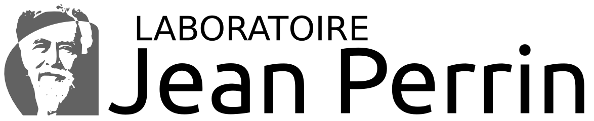
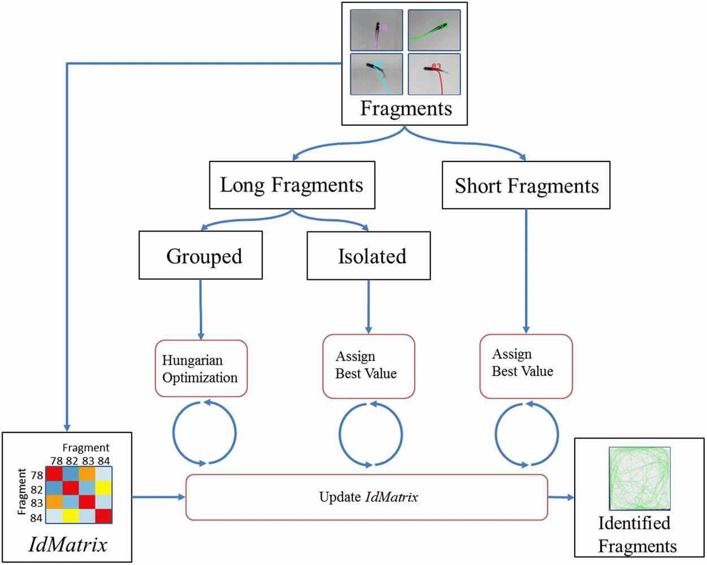
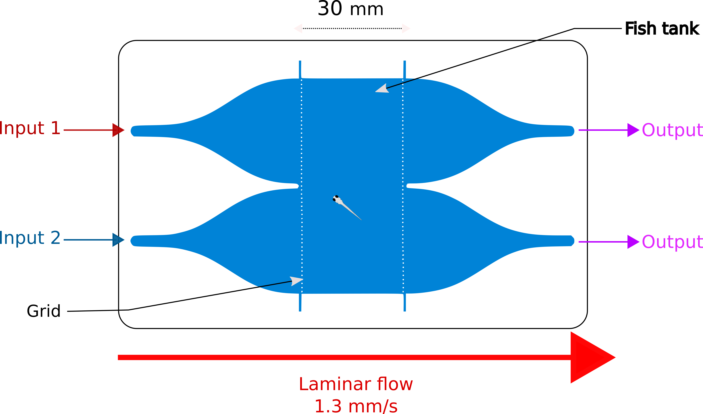
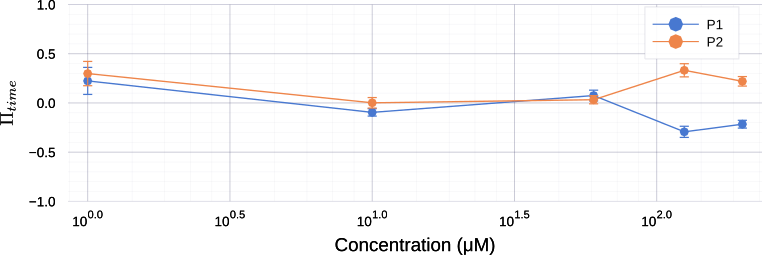
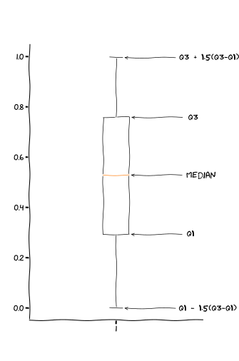
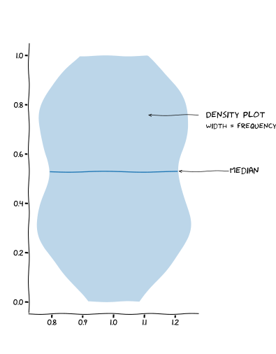

---
author:
- Benjamin Gallois
bibliography:
- biblio.bib
title: Draft v0.1
---

 

::: {.center}
Thèse de doctorat

Sorbonne université

École doctorale nº564 : Physique en Île-de-France

**Assessing chemical perception of the young zebrafish**

réalisée au Laboratoire Jean Perrin par\
**Benjamin Gallois**

soutenance le 31 Mars 2021\
devant le jury composé de\
**M. JOLY Jean-Stephane Referee**\
**M. BOURDIEU Laurent Referee**\
**Mme WYART Clair Examinator**\
**Mme HONG Elim Examinator**\
**M. THIRIA Benjamin Examinator**\
**M. DEL BENE Filippo Examinator**\
**M. CANDELIER Raphaël Thesis director**\
:::

# FastTrack: a general tracking software

## Introduction

::: {.epigraph}
Talk is cheap. Show me the code.

Linux Torvald
:::

### Video based tracking

The tracking of objects from video recordings is a problem that has
gained much popularity in recent years. It is mostly due to its great
potential, both in academia and for commercial and security
applications. Examples include autonomous cars that can drive
themselves, or the Airbus ATTOL project [@ATTOL] that allows fully
automated take-off, landing, and taxiing of planes based solely on image
analysis. A large part of the research effort is focused on creating
pedestrian recognition and tracking algorithms to automate the analysis
of video surveillance data. Tracking is also widely used in movie
creation with special effects (VFX, CGI), whether to stabilize shots or
to realize special effects (e.g., motion capture), and for industrial
process [@luo1988adaptive]. In this case, automated tracking on images
reduces costs, production time, and human operators' use.

In academia, the use of automated tracking, especially in biology and
ecology [@dell2014automated; @risse2017fimtrack], is a rapidly growing
field because it avoids disturbing the animals with invasive markings.
Cellular motions tracking is also widely studied with very specialized
algorithms developed solely for this purpose
[@juang2009tracking; @dewan2011tracking]. Other fields of science are
interested in automated tracking, to name a few: microfluidic
[@jeong2018accurately], active matter [@bricard2013emergence], social
science [@ali2012multiple] and robotic [@treptow2004real]. Automated
tracking generally produces large amounts of reliable data, reduces
biases and avoids long and tedious manual analyses. The latter are
sometimes impossible to perform due to excessively large image
collections.

Object tracking can be separated into two categories: the Single Object
Tracking (SOT), where the goal is to detect a single object in a more or
less complicated scene, and the Multiple Object Tracking (MOT), where
the goal is to detect and track several objects. In this dissertation,
we will place ourselves within the MOT framework since it is more
representative of the applications usually encountered in academia. For
many scientific experimental setups, the inherent difficulty of tracking
can be greatly mitigated with a well-designed system. In general, the
setups are designed to optimize the imaging conditions, with a fixed
camera and a lighting that facilitates object detection. On the other
hand, the tolerance to errors is low if one wants to produce reliable
data and robust scientific conclusions. A decisive point is the
algorithm's performance, which must analyze the data in a reasonable
time compared to their production rate and meet the user's material and
technical constraints. The ease of installation and use of the software
that integrates the algorithm should not be neglected. The users brought
to use these software are generally not experts in computer science and
image analysis, and the software must be readily installable and usable
by all.

We will first see why the tracking is still a complex problem and how we
can reduce or bypass this complexity. We will then present a
non-exhaustive list of existing tracking software applied to diverse
scientific fields. Finally, we will present how the software we have
developed for general-purpose tracking follows a different approach, and
in which cases it can be useful.

### The tracking, a not so simple problem

The image-based tracking of objects usually involves three key steps:
the acquisition of the images, which, depending on the acquisition
parameters, will condition the difficulty of the tracking and the type
of algorithm that can be used; the detection of objects, which consists
in separating the objects from the background; and finally the
assignment of objects from one image to another allowing to keep track
of the objects' identities. Object tracking is generally a complex image
processing task [@dell2014automated]. Depending on the objects studied,
each step can be difficult. For example, animals are highly deformable
objects interacting with each other, making the detection step complex.
The scene can be complicated, with objects disappearing behind the decor
elements, superimposing each other (the so-called occlusion phenomenon),
or entering and leaving the field of view, complicating the detection
and the association step.

Object detection problems can usually be circumvented by the design of
the experimental setup whenever it is possible. A fixed point of view
and lighting optimization usually allows for simple detection by
subtracting a background image (without objects) and applying a
threshold. For more complicated cases, a wide variety of algorithms are
available [@yilmaz2006object] and applicable depending on the images'
quality. The most common is to detect points of interest in the object.
This technique is invariant to the point of view and illumination but
requires a sufficient image quality. Segmentation allows to separate the
image by area of similarities and thus to detect objects of interest,
many algorithms and approaches exist to segment an image. Machine
learning can also be applied for objects detection [@zhao2019object].

Two main classes of algorithms can be distinguished to mitigate
association problems. The first class of algorithms uses the object's
kinematic quantities, such as direction or position
[@qian2016effective], to predict or find the position of the object on
the next image and thus keep its identity. This method's error rate
remains constant when we increase the number of individuals (keeping the
density of objects fixed). It is generally fast, and this makes it a
good candidate for real-time tracking applications. The major
disadvantage of this approach comes from the error propagation
phenomenon. If the algorithm makes an error in the assignment, it has no
way to correct the error at the next step, and it propagates to the end
of the analysis. The second class of algorithms is based on recognizing
the object's points of interest, allowing the creation of a
\"fingerprint\" unique to each object. That can be done using either a
classical method [@perez2014idtracker; @bai2018automatic], or using
machine learning [@mathis2018deeplabcut; @romero2019idtracker]. This
technique solves the propagation of errors problem and allows objects to
be tracked over time, i.e., across several unpaired videos. For example,
an animal can be recognized from one day of experiments to the next,
which can be very useful, especially for behavioral studies. This method
requires images of sufficient quality to extract markers representative
of the object. It also requires more computational resources, thus an
analysis that cannot be done in real-time. However, the main limitation
is the number of objects it can track. It is currently limited to about
ten objects per image with classical methods before the algorithms'
performance degrades significantly. The machine learning approach makes
it possible to increase the number of objects at the cost of long
computation time and the need to use high-performance computers.

### Existing software

Many tracking software already exist. We will make a non-exhaustive list
of the most popular ones, separating them into two categories:
proprietary software and open-source software.

#### Proprietary software

The proprietary software presented here are closed-source. The user
cannot modify the code to adapt the software to his project or check
precisely how the tracking is performed. On the other hand, they do not
require any computer knowledge and benefit from a support service
convenient for users that do not have a lot of computer knowledge. They
are an excellent alternative to other options that are sometimes
difficult to implement, but their high price can be a hindrance for some
users.

###### EthoVision XT

EthoVision XT is a software developed by the company Noldus. It
accompanies the user from the acquisition of images, thanks to a system
of experiment templates, to the data analysis with a module allowing to
visualize standard behavioral parameters. The software is complete and
widely used. It is somewhat specialized in the field of behavioral
neurosciences. It includes modules for classical behavioral experiments
(e.g., water-maze, rats social interaction). It also allows performing
live tracking so that users do not have to save images for long
experiments.

EthoVision XT is a mature software. A large number of modules are
available as well as a system that allows the user to create its own
experiment template. The most significant disadvantage is that the user
cannot modify the software or control how the tracking is done. Price
can be a barrier for some users, as the software costs a minimum of
5,850 USD without modules, and it is compatible only with Windows.
Focused on tracking animals, it will not be suitable for other systems.

###### Any-maze

Any-maze is a software developed by Stoelting Co. It is specialized in
the analysis of behavioral neuroscience experiments. It directly
integrates tools for standardized tests (e.g., forced swim test, fear
conditioning test), allowing fully automated analysis of these
experiments. It can track in real-time or from recorded videos.

Any-maze is a complete solution for creating and analyzing typical
behavioral experiments. It can be purchased with the experimental setup
already optimized and calibrated for the software. The Any-maze suite
consists of three software packages. The tracking part is available for
USD 6,495 or USD 1,500 per year. The software is available for Windows
only.

###### ToxTrack

ToxTrack [@rodriguez2018toxtrac] is a software that implements in a
graphical interface the ToxId algorithm [@rodriguez2017toxid]. In short,
the algorithm extracts objects from the background by applying a
threshold. The pieces of trajectories between occlusions are divided
into short and long trajectories based on a user-defined threshold time.
A group of long trajectories where all individuals are observed
simultaneously is then extracted. In this case, the assignment is made
using the Hungarian algorithm
Figure [8](#appendix_hungarian){reference-type="ref"
reference="appendix_hungarian"}. The remaining trajectories are then
assigned to the corresponding object selecting the best correlation
value in a trajectory identification matrix
Figure [1.1](#part_1:toxId){reference-type="ref"
reference="part_1:toxId"}. This matrix contains the similarity between
every two trajectory fragments based on objects' features. The authors
report that ToxId is as powerful as other existing software, fast, and
can track objects in real-time. A disadvantage that can be seen in this
algorithm is that it only works for a constant number of animals. The
algorithm's initialization requires to have at one moment $t$ all the
objects to be tracked simultaneously detectable for a user-defined time
$t+dt$. The user-interface (UI) is sometimes difficult to use: the
integrated tracking reviewer does not permit to correct the tracking or
to replay the tracking frame by frame.

The UI includes tools to define areas of interest as well as statistical
analysis of the collected data. The software is only available for
Windows. The project initially open-source change to a closed-source
model, but the software is still under development.

{#part_1:toxId
width="75%"}

#### Open-source software

Open-source software allows the user to read, modify, and distribute the
software. It is the preferred alternative to commercial software. From a
scientific perspective, using open-source software increase transparency
and lead to easier reproducibility of scientific results. From a
development standpoint, it leads to better code quality and fewer bugs.
In general, no individual assistance service is provided. The
collaborative development of most of these software allows the user to
report bugs and participate in their development to help the community.

###### idTracker

IdTracker [@perez2014idtracker] is a MATLAB library that allows to track
multiple objects in video recordings. It is based on the extraction of a
\"fingerprint\" for each object, allowing a tracking without errors
propagation. The advantage of idTracker is that it can recognize an
object over several videos and after a relatively long time, which can
be useful to track individuals' behavior over several series of
experiments.

IdTracker is solving amazingly well the error-propagation problem during
the association phase. However, it is limited by the number of objects
it can track, currently about twenty, due to the movie's length
necessary for extracting each object's \"fingerprint\". This task can go
up to 30 minutes minimum for a high object density. The required image
quality is an essential factor and must be at least 150 pixels per
animal. The computation time is relatively long, in the order of 0.5 to
2 seconds per image, and requires a large amount of RAM. The
installation of idTracker can be done without the need to install MATLAB
thanks to the Matlab Run Time Compiler but only under Windows.
Therefore, it is necessary to purchase a MATLAB license for other
platforms and have minimal knowledge of the language to set up
idTracker.

###### DeepLabCut

DeepLabCut [@mathis2018deeplabcut] is a framework that solves the
so-called \"pose estimation\" problem, which consists of finding an
object and its position, or part of an object, in an image. It can be
directly related to the SOT problem if the objects to be tracked are
different, for example, a right mouse ear and a mouse nose, which can
then be found on each image and then associated in the case where there
is only one mouse. In the case of several similar objects to be found
and associated from one image to another (MOT), this detection will have
to be combined with an association step to obtain the tracking. Even if
DeepLabCut answers a slightly different problem, it can, by its design,
be coupled with an external association algorithm to make a tracking
software.

DeepLabCut is directly based on the feature detection algorithm of the
DeeperCut framework [@insafutdinov2016deepercut], specialized in the
detection of human body movements. The authors of DeepLabCut have
studied this algorithm's performance applied to the field of behavioral
neuroscience, such as the detection of mice snouts or drosophila legs.
They have added tools to train the algorithm easily and test its
robustness.

It takes advantage of deep learning to solve the so-called estimation
pose problem. Deep learning is a machine learning algorithm that
consists of training a neural network containing several layers
[@Goodfellow-et-al-2016]. In DeepLabCut, the network consists of several
residual neural networks (ResNets) pre-trained on the ImageNet database.
The network is then fine-tuned by training on images where the parts to
be detected are annotated. In the end, the algorithm gives the
probability of presence of the object in the image. The authors have
shown that the performance is at least as good as human detection and
can be obtained with very little training data (200 annotated images).

DeepLabCut, as previously mentioned, is a framework, and despite an
excellent documentation [@nath2019using], it can be challenging to use
for a user with little computer skills. The installation process lasts
from 10 to 60 minutes and requires a GPU installation to get the most
out of the software. Besides, the algorithm requires a lot of computing
power. To give an idea, images of 682x540 pixels, analyzed with a
last-generation GPU, lead to an analysis speed of 30 frames per second.
Without GPU, this time can be multiplied by a factor of 10 or 100
[@mathis2018inference].

We see that DeepLabCut is of great interest to precisely find objects in
an image. It is particularly aimed at behavioral neuroscience, allowing
complex movement tracking (e.g., hand fingers of a mouse). It will not
be suitable for users with little computer knowledge interested in more
extensive problems and with little data to process.

{#part_1:deeplabcut width="75%"}

###### idTracker.ai

IdTracker.ai [@romero2019idtracker] is a framework that allows tracking
animals with almost perfect accuracy. IdTracker.ai takes advantage of
deep learning to carry out the association. In the first step, each
object is segmented by applying a threshold. A convolutional network
classifies each detected blob as containing a single object or several
objects. Another convolutional network finds the identity of each
individual throughout the movie.

This system requires enough data to train the network that will
recognize each individual. The authors found that robust tracking can be
obtained with only thirty isolated images of each individual. Therefore,
it is necessary to plan for a minimum of five hundred images for a dozen
individuals with a minimum of twenty-five frames per second. A
resolution of three hundred pixels per animal is recommended for good
tracking accuracy. A limiting factor of idTracker.ai is that it requires
a lot of computing time and a lot of RAM. The authors report about
twenty minutes for processing a video with eight zebrafish and about six
hours for a hundred zebrafish on about two thousand high definition
images. Even if a UI is available to help the user, primary computer and
programming knowledge is required, and suitable hardware. The use of a
GPU is strongly recommended.

This software is suitable for users who want perfect and fully automated
tracking from high-quality videos having a powerful computer. A tool is
integrated to review and correct the tracking, but the lack of ergonomy
makes it sometimes difficult to use.

{#part_1:idtrackerai
width="75%"}

### FastTrack: an original approach

We have previously listed the most used tracking software in different
fields of science. We can see that a fast software requiring little
computing power, versatile (i.e., that can be applied to any systems
with a variable number of objects), easy to install, and open-source is
missing. To fill this void, we designed a software called FastTrack.
This software contains two distinct parts:

-   An interface where standard image analysis procedures are
    implemented to detect objects, and a tracking algorithm that allows
    keeping the identity of objects from one image to another, fast and
    with a low error rate.

-   An ergonomic interface where the tracking can be checked and
    manually corrected if necessary.

FastTrack has a different approach than the software previously
mentioned. Instead of exploiting a high computational power to achieve a
reliable result without any human intervention, FastTrack implements a
simple, very general method. The few resulting tracking errors are left
to manual corrections. In terms of result accuracy, both approaches lead
to a quasi-perfect tracking. In terms of speed, human interventions
during the post-processing are costly. However, the automatic tracking
part is performed much faster, and we noticed that using FastTrack is
usually faster. From the images to the trajectories, the duration of the
whole process is notably reduced for small projects due to the fast
installation and ease of use of FastTrack. Besides, many researchers
want to double-check the resulting trajectories to ensure the
reliability of the trajectories or get some sense of their objects'
dynamics to orient the subsequent analyses, which is performed natively
in the FastTrack workflow. This solution has several advantages, the
first one being that it does not require any programming knowledge. Any
user can perform a perfect analysis in a very short time. Moreover, it
we will see in the following that the post-processing work can be
estimated by an analysis of the geometrical and dynamic parameters of
the studied system, which allows the user to know if the software is
adapted to his needs. For many of the systems studied, the
post-processing is only a quick check. If the number of occlusions is
too high, and a perfect tracking accuracy is necessary without having to
resort to manual correction, another solution must be considered.

FastTrack is distributed under a free software license and implemented
in a modular and fully documented manner. Each user can thus modify the
software at his convenience or contribute to it. The tracking algorithm
is decoupled from the detection and correction interface, which makes it
extremely easy to integrate FastTrack into an existing project. The
software is easily installed in less than 5 minutes and is compatible
with Linux, macOS, and Windows. It can run on modest configurations and
Single Board Computer (SBC) such as the Raspberry Pi.

## Movies dataset

To demonstrate that FastTrack can analyze movies from various systems,
we have compiled a collection of movies named the Two-Dimentional
Tracking Dataset ($TD^2$). This dataset can be downloaded at
<https://data.ljp.upmc.fr/datasets/TD2/>. The films either come from
data already published in the literature or provided by the authors
themselves. All the movies are under a CC-BY-NC-SA license. Each movie
is identified by a 3-letter code defining the system (e.g., ACT: active
matter, ZFA: zebrafish adult\...) and three digits to index films from
an identical system. $TD^2$ currently regroups 41 films, including
different types of objects of very different nature and size

-   7 species of animals from fish to flies,

-   cells,

-   active particles,

-   microfluidic drops,

-   macroscopic objects such as ultimate players or cars.

A video giving a quick overview of all the systems used is available at
<http://www.fasttrack.sh/images/illustrations/mockups/trackingExample.webm>.

Another essential aspect to consider is the number of objects per film
and their possible appearances, disappearances, and overlaps. In 22
films out of 41, the number of objects is variable, and objects come and
go out of the camera field during recording. In 19 films out of 41,
objects may overlap, creating an occlusion phenomenon that the software
has to manage to preserve the identity of the objects.

{#part_1:dataset width="100%"}

## Design and implementation

::: {.epigraph}
Testing can only prove the presence of bugs, not their absence.

Edsger W. Dijkstra
:::

### Tools used

The choice of tools and libraries used in designing software is
paramount, and several selection factors must be taken into account.

The first criterion to consider is the license. We chose to put
FastTrack under a free license (GPL3), which implies that the language
used and the libraries must also be under compatible licenses. The
choice of an open-source license is preferable in the case of scientific
software [@easterbrook2014open]. Poor code quality naturally leads to
what is called a technical debt. Choosing the \"quick and dirty\"
implementation instead of a time-costly but maintainable solution can
hurt the project in the long goal by costing time and effort to run and
maintain the code. Open-source can help to solve this problem. First, it
is a strong incentive to produce clean code, knowing that it can be
read, checked, and used by other people. Moreover, cooperative work can
help solve bugs faster than a closed-source model. Finally, open-source
projects, well documented, can make accessible tools for non-technical
scientists that would otherwise have been impossible.

The second criterion is to carefully choose the libraries used,
considering the future of the software so that the developers do not
have to change libraries if their capabilities prove insufficient as the
software evolves. Mature libraries offering long-term support are thus
preferred.

In this perspective, FastTrack has been implemented in C++ using the Qt
[@Qt] and OpenCV [@opencv_library] libraries for the graphical interface
and image analysis, respectively. Unit tests are performed using the
Google Test library.

C++ is a computer language created by Bjarne Stroustrup in 1985
[@stroustrup1996history]. Offering high performance, it is standardized
by the International Organization for Standardization (ISO). It is the
language of choice for image analysis applications and the creation of
complex graphical user interfaces.

Qt is an open-source GUI library created by Haavard Nord and Eirik
Chambe-Eng, two physicists, in 1991 when developing ultrasonic image
analysis software. With extensive documentation and a large community,
it is very mature. It allows creating graphical user interfaces for
Linux, Mac, and Windows from the same source code.

OpenCV is an open-source image analysis library created by Intel in
1999. Very complete and efficient, it has become the reference in image
analysis for both academics and commercial applications.

Google test is a suite for automating unit tests in C++. OpenCV notably
uses it. The purpose of unit tests is to verify that each part of the
program works as expected. This practice has several advantages:
detecting more easily possible errors during the implementation of new
features and facilitating software development when it grows in size to
avoid any error inclusions. This series of tests are automatically
performed on each new commit, see Section
 [3.3.1](#part_1:cicd){reference-type="ref" reference="part_1:cicd"} for
more information.

### Implementation

FastTrack's operation can be divided into three parts: the objects'
detection (detection), the objects association from one image to another
(matching), and finally, a manual correction step (post-processing).

Each analysis begins with the opening of an image sequence or a video
file. The user can choose between two types of interfaces, an
interactive interface where he can only open one film at a time. It
allows the user to see, in real-time, the impact of parameters on the
images, which facilitates the determination of optimal analysis
parameters. A second interface allows many movies to be opened
simultaneously, either by giving a parameter file or selecting the
parameters in the interface. It is useful when the user wants to analyze
many movies for which he already knows the optimal analysis parameters.

Both interfaces can be used in a complementary way. The user can find
the optimal parameters with the interactive interface and then automate
the analysis of many movies by tracking them in batches in the software.

{#part_1:fig_1 width="75%"}

#### Detection

The purpose of the detection step is to extract each object's kinematic
parameters, which will be used later during the association step.
FastTrack includes a collection of image analysis filters that allow the
user to optimize object detection without external software.

###### Background Calculation

Each analysis starts by calculating a background image. If the user
already has a previously saved background image, he can directly open it
in the software. Otherwise, three calculation methods are possible:

-   Projection of maximum intensity.

-   Projection of minimum intensity.

-   Projection of the average intensity.

All three methods are based on the same principle. The user chooses $n$
images in the sequence. The software will make a projection of the stack
along the time component, either the maximum, minimum or average of each
pixel. In practice, the maximum (resp. minimum) will be projected if the
objects are darker (resp. lighter) than the background so that the
objects disappear and thus obtain the background. The user can make the
registration of each image before the projection in order to correct for
possible minute camera movement.

###### Registration

The user can choose to register the images. Three methods are proposed
in the software. Each method is implemented in a pyramidal way, i.e.,
the registration is first carried out on a degraded image to roughly
correct the displacement. The correction is then refined by increasing
the image quality until the original quality is reached. This speeds up
the process, as registration is often a relatively time-consuming
process.

The first method proposed is phase correlation [@stone2001fast]. It
corrects the translational movements between two images using the
Fourier theorem in the frequency domain. This method is swift but
remains limited to small translational movements only.

The second proposed method is the Enhanced Correlation Coefficient (ECC)
[@evangelidis2008parametric] method. In FastTrack, it is restricted to
correcting translational and rotational movements only. It consists of
using the correlation coefficient as a measure to find the best
transformation between two images. This method's advantage is that it is
relatively fast since this non-linear optimization problem can be solved
linearly. It is efficient for noisy images and having photometric
distortions.

The third method is a method based on the identification of key points.
It allows for correcting movements and deformations (homography). The
key points (about 500) are automatically determined on two images thanks
to the ORB algorithm [@rublee2011orb]. These points are then associated
two by two using the hamming distance. The RANSAC algorithm
[@bolles1981ransac] is used to find the best transformation between the
two images. This method, more precise, requires a sufficient image
quality to be able to discern key points.

![**Image registration.** Two recordings with severe drift are used for
the benchmarking (top: $DRO\_001$, bottom: $ULT\_001$). (**A**)
Comparison of a frame (magenta) with the first frame (green) and
magnification of details in the scene. (**B**) The root mean square
deviation (RMSD) of pixel intensities after registration onto the first
image, averaged over all time frames and normalized by the RMSD without
registration, for the three registration methods. Error bars: standard
deviation across time frames. (**C**) The relative average computation
time of the three registration methods, normalized by the total number
of pixels in the movie (arbitrary units). Error bars: standard deviation
across time frames.](part_1/assets/Figure_2.png){#part_1:fig_2
width="100%"}

Figure [3.3](#part_1:fig_2){reference-type="ref"
reference="part_1:fig_2"} provides a rough comparison of the performance
of the three methods. Using two recordings of the $TD^{2}$ dataset, we
benchmarked both the accuracy -- with the root mean squared difference
(RMSD) of pixel intensities between the reference and the corrected
image -- and the relative computation time. Choosing the right method to
obtain the best accuracy depends on each movie's characteristics.
However, one can use the rule of thumb that if the objects to track
occupy a large fraction of the total area, the best accuracy is more
likely to be obtained by using ECC and using the features-based method
otherwise. However, as shown in
Figure [3.3](#part_1:fig_2){reference-type="ref"
reference="part_1:fig_2"}-C, the ECC method is generally slower by an
order of magnitude. Hence, we recommend using the features-based method
in the general case and long movies.

###### Binarization

Each image is then binarized by subtracting the background image and
defining a threshold value. In the interactive mode, the user can see
the impact of the parameters on the image, which makes it easier to
adjust the binarization threshold. The software also detects if the
background is darker (resp. lighter) than the objects allowing to have
at the end of this operation a binary image where the pixels belonging
to the object are equal to 1, and the pixels belonging to the background
are equal to 0.

###### Morphological operation

A set of morphological operations (dilation, erosion, opening, etc.) can
be performed on the binary image to improve detection and eliminate
possible artifacts. Different shapes and sizes of kernels are available.

###### ROI

The user can select a region of interest and exclude the rest of the
image from the analysis. This speeds up the analysis process and avoids
the detection of interfering objects. In interactive mode, this ROI can
be drawn directly on the image.

###### Sorting

To exclude objects that are too small (e.g., noise) or too large ( e.g.,
two objects overlapping each other), the user must select two
characteristic sizes. The objects are colored either red or green in the
interactive mode depending on whether their size belongs to the selected
range.

###### Extracting kinematic parameters

Based on the binary images, the software will detect the contour of each
object. An essential step in any tracking procedure is the extraction of
the parameters used in the matching step. It is generally with the
choice of these quantities that the tracking algorithms can differ to be
more specialized for a given type of object. In FastTrack, the
parameters extracted are the center of mass, the orientation, the area,
and the object's perimeter. These quantities are quickly calculated and
general enough to adapt to a wide variety of objects.

To do this, FastTrack calculates the object's equivalent ellipse from
the second-order moments of the binary image [@rocha2002image]. This
procedure is accelerated by directly using the contour thanks to Green's
formula [@riemann_1851]. The object's orientation is given by the
ellipse's major axis and is defined in the interval $[0;\pi[$. The
direction in the interval $[0; 2\pi[$ is determined by projecting each
object's pixel on the major axis of the equivalent ellipse, and
calculating the skewness of the distribution of distances of these
projected points to the center of mass. The sign of the skewness is a
robust indicator of the object's asymmetry along its principal axis. For
deformable objects, the previously calculated direction may be different
from the direction of motion. For example, in the case of zebrafish, it
bends its body periodically to move. Only the head is directed at the
motion. This is why the object is decomposed into two equivalent
ellipses. The user can then choose which ellipse best represents the
direction of the movement.

{#part_1:fig_2 width="100%"}

#### Matching

The purpose of the association step is to keep the objects' identity
from one image to another. To do so, FastTrack uses a method derived
from [@qian2016effective], which takes advantage of the fact that each
object's position, area, perimeter, and direction changes very little
from one image to another.

For each pair of objects $(i,j)$ belonging to two successive images, two
costs are calculated: a hard cost that is a threshold set to $1$ or
$+ \infty$, and a soft cost that is a normalization parameter. This
terminology is brought from statistical physics, where particles can
have soft, long-ranged interactions or hard, binary contacts. The hard
cost is defined as follows: $$\left\{
            \begin{array}{ll}
                h_{i,j} = 1 & \mbox{if } r_{i,j} < h_{d} \\
                h_{i,j} = \inf & \mbox{else }
            \end{array}
        \right.$$ with $r_{i,j}$ the distance between objects i and j,
$h_{d}$ a threshold representing the maximum travel distance allowed
between two successive images. The hard cost allows discarding obvious
impossible assignments to speed-up the computation. It is essential with
a non-constant number of objects because it allows new objects entering
the field of view to be assigned with new identities.

The soft cost is then defined as follows:
$$c_{i,j} = \frac{r_{i,j}}{s_d} + \frac{\delta\alpha_{i,j}}{s_{\alpha}} + \frac{a_{i,j}}{s_a} + \frac{p_{i,j}}{s_p}$$
where $\delta\alpha_{i,j}$ is the angular difference, $\delta a_{i,j}$
the area difference and $\delta p_{i,j}$ the perimeter difference
between objects i and j. To compare these quantities expressed in
different dimensions and magnitudes, one need to normalize them. We
define the soft normalization coefficients: $s_{d}$, $s_{a}$, $s_{p}$
and $s_{\alpha}$. These coefficients represent the typical value of the
parameter that they normalize. We can construct the cost matrix:
$$C_{i,j} = \left\{
            \begin{array}{ll}
                c_{i,j} & \mbox{if} r_{i,j} < h_{d} \\
                \inf & \mbox{else}
            \end{array}
        \right.$$ This cost matrix is, in general, rectangular because
the number of objects can vary from one image to the following. A memory
parameter can be selected to assign a new identity to an object that
disappears on more than the selected number of images. In this case, the
row corresponding to this object is removed from the cost matrix and the
object can be assigned in the subsequent images. We want then to find
the best possible matching. This problem is called the rectangular
assignment problem and can be solved exactly by using the Hungarian
algorithm see Annexe [8](#appendix_hungarian){reference-type="ref"
reference="appendix_hungarian"}. FastTrack uses the Kuhn-Munkres
implementation in C++ to solve it.

#### Automatic tracking parameters

Finding the optimal tracking parameters is necessary to have a tracking
accuracy as good as possible. FastTrack can automatically determine a
neutral set of soft normalization factors $s_r$, $s_\alpha$, $s_a$, and
$s_p$ to help the user. These factors allow comparing terms of very
different nature and amplitude into a single cost function. The set of
parameters automatically found by FastTrack will give each term the same
weight inside the cost function. Therefore, the user must perform
parameters' fine-tuning, with some system insight, to get the best set
of parameters possible.

It is intuitive to use the standard deviation of the increments of each
kinematic parameter. However, some trajectories are needed to estimate
the standard deviations. We set up an iterative, rapidly-converging
algorithm to perform this talk.

Let us use $ZFJ\_001$, a movie with many occlusions and objects of
different sizes to illustrate the algorithm's details. For simplicity,
let us use only the position, angle, and area as kinematic parameters.
There is no gain to expect by adding the perimeter parameter because
objects' shapes are very similar. The
Figure [3.4](#part_1:fig_5){reference-type="ref"
reference="part_1:fig_5"}-A. shows a snapshot of this movie.

To evaluate the distributions of $dr$, $d\alpha$, and $da$, we start by
tracking the movie setting the hard parameters and random soft
parameters. The resulting distributions are shown in
Figure [3.4](#part_1:fig_5){reference-type="ref"
reference="part_1:fig_5"}-C to E. For kinematic parameters whose
differential values can be positive or negative, the distribution is
fitted by a Gaussian function, and the soft parameter is set to the
standard deviation. For instance, with the angular difference $d\alpha$
the fit reads:

$$f(d\alpha) = \frac{1}{s_\alpha\sqrt{2 \pi}} \; e^{-\frac{d\alpha^2}{2 s_\alpha^2}}
    \label{eq:fit_Gaussian}$$

and $s_\alpha$ (orange bar in
Figure [3.4](#part_1:fig_5){reference-type="ref"
reference="part_1:fig_5"}-D) is stored as the soft parameter to use
during the next iteration. The computation of the soft parameter for the
displacement $s_r$ is different since distances can only be positive.
Assuming that the displacements along the $x$ and $y$ axes follow two
independent Gaussian processes, the resulting displacement follows a
$\chi$ distribution with $2$ degrees of freedom, and the fit reads (see
Annexe [9](#part_1:annexe_chi){reference-type="ref"
reference="part_1:annexe_chi"} for the detailed derivation):

$$f(x)=\frac{x}{(\frac{s_{r}}{\sigma_0})^2}e^{-\frac{1}{2}(\frac{x}{\frac{s_{r}}{\sigma_0}})^2}
        \label{eq1}$$

where $s_r$ (orange bar in
Figure [3.4](#part_1:fig_5){reference-type="ref"
reference="part_1:fig_5"}-C) is stored as the soft parameter to use for
the next iteration and $\sigma_0^2=2-\mu_0^2=\frac{4-\pi}{2}$.

Once all soft tracking parameters have been derived from the
distributions, the software recomputes new trajectories with these
updated parameters. This iterative process, depicted in
Figure [3.4](#part_1:fig_5){reference-type="ref"
reference="part_1:fig_5"}-B, is run until the tracking parameters
converge. In practice, the convergence is very fast, regardless of the
initial position in the parameters space. We drew $100$ sets of seed
parameters from uniform distributions spanning large intervals, and
convergence has been attained in very few iterations for all parameters
Figure  [3.4](#part_1:fig_5){reference-type="ref"
reference="part_1:fig_5"}-F.

FastTrack's implements this algorithm by taking the kinematic
quantities' sample standard deviation for a subset of 200 images in the
movie to increase speed and efficiency. The convergence criterion
implemented is that soft parameters should vary less than $10^{-3}$ of
the corresponding parameter.

To characterize the resulting tracking, we computed the number of swaps
with respect to the ground-truth:

$$P_{swap} = \frac{N_{swap}}{N_{obj} - n_{ap}}
    \label{eq:Pswap}$$

with $N_{swap}$ being the total number of swaps, $N_{obj}$ the total
number of objects on all frames and $n_{ap}$ the number of times a new
object appears. If the number of objects is constant and noted $n$, then
$n_{ap} = n$ and $N_{obj} = nT$, with $T$ the number of frames in the
recording, such that $P_{swap}$ can be simplified:

$$P_{swap} = \frac{N_{swap}}{n(T-1)}
    \label{eq:Pswap_constant}$$

$P_{swap}$ converges very fast to a value that is nearly-optimal. For
$77\%$ of the parameter sets $P_{swap}$ is decreased or remain equal,
with an average drop of $0.0119$ ($155$% of the converged value), while
for 23% of the parameter sets $P_{swap}$ is increased with an average
rise of $0.0011$ ($14$% of the converged value). Thus, the expected
difference is $-0.0090$ ($116$% of the converged value) for this movie.
Therefore, the automatic parameters are an excellent starting point in
the general case. The user can fine-tune the weights given to the
kinetic parameters to consider the specificities of each movie.

We computed the converged soft parameters $\hat{s}_r$, $\hat{s}_\alpha$
and $\hat{s}_A$ for several sampling rates of $\tau>1$
(Figure [3.4](#part_1:fig_5){reference-type="ref"
reference="part_1:fig_5"}-H to J). We used these parameters to track the
$ZFJ\_001$ movie at different $\tau$ and compute $P_{swap}$. A
comparison between $P_{swap}$ and $P_{inc}$ (see
Section [4.2](#pinc){reference-type="ref" reference="pinc"}) as a
function of $\tau$ is shown in
Figure [3.4](#part_1:fig_5){reference-type="ref"
reference="part_1:fig_5"}-K. This comparison illustrates that $P_{swap}$
is a noisier measurement of a movie's trackability than $P_{inc}$ and
confirms that the iterative algorithm produces trajectories with a
number of errors that is close to the statistical limit.

![**Automatic tracking parameters.** (**A**) Snapshot and blow-up of
$ZFJ\_001$ movie, with definition of $\vec{dr}$ and $d\alpha$ (**B**)
Scheme of the algorithm determining the tracking parameters
automatically. (**C-E**) Distribution of displacements $dr$ (in pixels),
angular differences $d\alpha$ (in radians) and area differences $dA$ (in
pixels) when the default parameters of the software are used on
$ZFJ\_001$, for $\tau=1$ (black). The corresponding $\chi$ and Gaussian
fits are displayed in red. Orange bars: resulting soft parameters.
(**F**) Evolution of $s_r$, $s_\alpha$ and $s_A$ with algorithm
iterations for $ZFJ\_001$. Left: iterations 1 and 2; right: iterations 2
and 3. A hundred runs with random initial values are shown. The run with
the software default parameters is highlighted in red. (**G**) Evolution
of $P_{swap}$ with algorithm iterations, same runs. (**H-J**) Evolution
of the converged parameters $\hat{s}_r$, $\hat{s}_\alpha$ and
$\hat{s}_A$ as a function of the timescale $\tau$ for $ZFJ\_001$.
(**K**) Comparison between $P_{swap}$ (blue crosses) obtained with the
converged parameters and $P_{inc}$ (red dots) for $ZFJ\_001$. The solid
black line is the logistic fit of
$P_{inc}$.](part_1/assets/Figure_5.png){#part_1:fig_5 width="100%"}

#### Manual correction

FastTrack integrates a manual tracking correction tool. Once the
analysis is completed, the result can be displayed in an ergonomic
interface created solely for this purpose. The user can replay the film
by superimposing the results of the analysis on the original movie. The
user can interactively see each object's parameters. More importantly,
the user can also correct tracking errors by deleting objects or
exchanging objects' identity. This interface is designed with ergonomics
and performance in mind. Keyboard shortcuts and an on-the-fly selection
of objects by clicking on the video allow the user to check and correct
the trajectories quickly. It is also possible to record a film with the
tracking results overlay superimposed.

This manual correction interface makes it possible to shift the workload
from the traditional pre-processing of data to the tracking result's
post-processing. In the following chapter, we will see how this method
can save the user time, the correction time being in general lower than
the conception and computational time of system-specific tracking
algorithms.

#### Output

After the tracking, the software generates several files containing the
results and the tracking parameters. The result file is named
tracking.txt, and it contains the raw data of the analysis with one
image and one object per line. This format is compatible with the most
used analysis software (R, Python, Julia, spreadsheet). Examples in
Python and Julia are available in the documentation to get started.

### Deployment

#### Continuous integration delivery {#part_1:cicd}

{#part_1:fig_cicd
width="100%"}

The deployment is one part that should not be overlooked in software
design, and two aspects are crucial to consider. From the user's point
of view, the software must be easy to install on supported platforms and
with fewer bugs as possible. From the maintainer's perspective, the
deployment part must be easily achievable and reproducible so that
patches and new functionalities can be quickly integrated. From the
developer's perspective, the source code's consistency and correctness
have to be tested at each change to avoid introducing bugs and
facilitate collaboration between developers. With this in mind,
FastTrack follows the CI/CD philosophy
[@shahin2017continuous][@wikstrom2019benefits] taking advantage of the
recent GitHub Actions system.

Continuous Integration (CI) is a set of practices designed to integrate
changes quickly into the project in an automated manner. It is coupled
with the automation of unit testing. FastTrack takes advantage of
GitHub's CI/CD system called Actions. With each new (commit[^1]) or new
(pull-request [^2]), a series of tests is automatically triggered. These
tests will check the proper functioning of the tracking algorithm and
the formatting of the source code. Only the changes that pass the tests
can be integrated into the project, which guarantees the reproducibility
of the analyses and the source code and documentation consistency.

Continuous Delivery (CD) automates the delivery of the software in its
final form. It allows changes to be quickly integrated into the software
without manually doing it for each supported platform. In the case of
FastTrack, the CD is implemented using GitHub Actions, and a new version
of the software is compiled for Linux, macOS, and Windows with each new
commit that is integrated into the main branch. Stable versions of the
software are compiled at regular intervals of the development. This
system is a significant time-saver for multi-platforms software like
FastTrack. It allows the user always to have the latest patches and
features available. The developers can collaborate easily on the
project, and the maintainer can quickly produce binaries for the
supported platforms.

FastTrack natively supports the three most commonly used platforms:
Linux systems with an AppImage that supports all distributions, Windows
with an installer, MacOS with an App. The latest stable version can be
downloaded from the website <http://www.fasttrack.sh>, the nightly build
version from <https://github.com/bgallois/FastTrack/releases>. The
procedure to compile the software itself is available in the developer's
documentation.

#### Documentation

FastTrack offers extensive documentation that covers the installation
and use of the software. Developer documentation with a documented API
and a compilation guide is also available for users wanting to integrate
FastTrack in their software or workflow.

###### User

User documentation is available at
<https://www.fasttrack.sh/UserManual/docs/intro.html>. This
documentation is generated from the project, and users can contribute to
it at <https://github.com/FastTrackOrg/FastTrack>. It contains all the
information needed to use the software and instructional videos to help
the user get started with the software.

###### Developer

Developer documentation is available at
<https://www.fasttrack.sh/API/index.html>. It is automatically generated
by the Doxygen software from the documentation in the FastTrack source
code. It contains all the information necessary for developers who want
to modify or contribute to FastTrack.

## Results

### Performance

To assess FastTrack's performance, we ran a benchmark comparing
FastTrack, Idtracker.ai, and ToxTrac. These software have substantial
intrinsic limitations compared to FastTrack. Both require an acceptable
framerate and image quality, with sufficient contrast and number of
pixels per object and a constant number of objects in the movie that
must be defined before the tracking. The benchmark was performed on a
dataset consisting of a selection of videos provided with each software,
and some movies from the $TD^2$ dataset that meet the three software
requirements. $idtrackeraivideoexample$ and $100Zebra$ are available on
the idtracker.ai website
<https://idtrackerai.readthedocs.io/en/latest/data.html>. Guppy2,
Waterlouse5, and Wingedant on the ToxTrac
SourceForge<https://sourceforge.net/projects/toxtrac/files/ScientificReports/>.
Movies provided in image sequence format were converted losslessly to a
video format using FFmpeg since idtracker.ai and ToxTrac could not
directly process image sequences. $DRO\_002$ and $ACT\_002$ were
preprocessed with a custom script to detect the objects before
performing the tracking. Also, only the first 100 images of $DRO\_002$
were used to reduce the computing time.

The benchmark between idtracker.ai and FastTrack was performed on a
workstation with an Intel i7-6900K (16 cores), 4.0 GHz CPU, an NVIDIA
GeForce GTX 1060 with 6GB of RAM GPU, 32GB of RAM, and an NVMe SSD of
250GB running Arch Linux. The parameters were set by trials and errors
inside the graphical user interface of the two software. The tracking
duration was recorded using a script calling the software command-line
interface. The average tracking duration and the standard deviation were
computed over five runs except for $DRO\_002$ (2 runs) and $ACT\_002$ (1
run) due to the very long processing time. Idtracker.ai was evaluated
with and without GPU capability except for $100Zebra$, $DRO\_002$, and
$ACT\_002$ due to the very long processing time.

The benchmark between ToxTrac and FastTrack was performed on a computer
with an Intel i7-8565U (4 Cores), 1.99 GHz CPU, 16 GB of RAM, and an
NVMe SSD of 1 TB running Windows 10. The parameters were set by trials
and errors in the graphical user interface. The average tracking
duration and the standard deviation were computed over five runs using
each software's built-in timer feature. The accuracy was evaluated
manually using the built-in review feature implemented in each software.
The number of swaps and the number of non-detected objects were counted
in each movie, and occlusion events were ignored in this counting.

![**Benchmark of FastTrack, idtracker.ai, and ToxTrac.** (**A-B**)
Comparison of the computation time for the tracking of various movies
with the same workstation. Whenever possible, CPU and GPU variants of
idtracker.ai have been run. Only the first 100 images of $DRO\_002$ have
been used. (**C-D**) Accuracies of the resulting trackings. \"perfect\"
means an accuracy of exactly $1$. The trajectories computed by the CPU
and GPU variants of idtracker.ai being rigorously similar, we only show
the GPU results. For $100Zebra$, the accuracy was computed by taking
into account only the first 200
images.](part_1/assets/Figure_benchmark.png){#part_1:fig_benchmark
width="\\textwidth"}

The accuracy was computed as follows:
$$A=\frac{n_{obj}n_{img} - (2N_{swap} + N_{undetected})}{n_{obj}n_{img}}$$
with $N_{swap}$ the number of swaps, $N_{undetected}$ the number of
non-detected objects, $n_{obj}$ the number of objects, and $n_{img}$ the
number of images. For $100Zebra$, the accuracy was computed only over
the 200 first images. All the results are presented in
Figure [\[part1:fig_benchmark\]](#part1:fig_benchmark){reference-type="ref"
reference="part1:fig_benchmark"}. As expected, FastTrack is several
orders of magnitude faster than idtracker.ai and significantly faster
than ToxTrac on all tested videos. That is mainly due to the method
used, idtracker.ai using deep learning and ToxTrac cost optimization and
the identity preservation algorithm. All software performed
exceptionally well in terms of accuracy, except idtracker.ai on
$ZFJ\_001$ probably because the resolution is not good enough.
FastTrack's ergonomic post-processing interface can be used to reach a
perfect tracking accuracy within a few more minutes. This built-in
manual correction is not possible in ToxTrac and lacking ergonomy in
Idtracker.ai.

Altogether, FastTrack offers many assets compared to idtracker.ai and
ToxTrac. The software is more versatile than its concurrents and more
comfortable to use. The total time spent to track a movie is globally
lower, in some cases by orders of magnitude, without sacrificing
tracking accuracy.

### Dataset classification {#pinc}

Analyzing movies from systems as different as those compiled in $TD^2$
is a real challenge. That is partly due to the recording conditions that
can be very diverse and make object detection more complex. Two
recurring difficulties can be discerned: variations in illumination
(e.g., reflection in GRA_001, shadows in SOC_001) and overlapping
objects (e.g., HXB_001).

In movies from the academic world, systems are often designed to limit
or circumvent these two difficulties. It is common to find movies with a
uniform and constant illumination. Also, quasi-2D confinement and a
restricted number of objects in the camera field reduce the number of
occlusions.

In $TD^2$, 23 movies have an illumination good enough to be analyzed
directly with FastTrack. The others had to undergo a specific individual
pre-processing before being analyzed. Two movies with too many
occlusions were discarded (HXB_001 and ZFL_001) because they could not
be analyzed with FastTrack nor by any other software. The remaining 39
films could be analyzed with FastTrack without difficulty. The
Kuhn-Munkres algorithm being of complexity $O(n^3)$ the calculation time
is generally quite fast. Each film was then manually corrected using the
built-in tool to get the ground-truth tracking.

FastTrack is designed to keep the post-processing phase as light as
possible. However, this phase workload varies greatly depending on the
movie being analyzed. This workload can be quickly estimated for a given
film by computing what we call the probability of incursion.

First, we define the incursion as the exit of an object from its Voronoi
cell (see Annexe [7](#appendix_voronoi){reference-type="ref"
reference="appendix_voronoi"}), defined at a time $t$, after a travel
time $\tau$. The number of incursions depends on

-   the distribution of the displacements,

-   the density of objects,

-   the geometry of the Voronoï cell

-   the degree of motion alignment of the displacements.

To consider the objects' density, we defined the reduced length
$\rho=r\sqrt{d}$ where $r$ is the length and $d$ the density. We remark
that typically $\rho=1$ is corresponding to the length between two
objects, and $\rho=0.5$ is the length between an object and its Voronoï
cell boundary.

Assuming that the dynamic is uncorrelated with the geometric properties
of the Voronoï cells, we can write the incursion probability as follows:
$$P_{inc}=\int_{0}^{\infty} R(\rho)p_{inc}(\rho) \,d \rho$$ where
$R(\rho)$ the distribution of the reduced displacement at the timescale
$\rho$, and $p_{inc}(\rho)$ the geometrical probability of incursion.

$p_{inc}(\rho)$ depends only on the geometrical properties of the
objects' arrangement. We can calculate $p_{inc}$ by taking a Voronoï
cell and determining the proportion of the angles for which a
displacement of $\rho$ implies an incursion in a neighboring Voronoi
cell. In other words, see
Figure [4.2](#part_1:fig_pinc){reference-type="ref"
reference="part_1:fig_pinc"}, we take a circle of radius $\rho$ centered
on the object and count $\Sigma$ the proportion of the circle that lies
outside the Voronoï cell. That will give us
$p(\rho)=\frac{\Sigma(\rho)}{2\pi}$ the geometric probability of
incursion for one cell. Then, to take into account the diversity of size
and shape of Voronoï cells, we average over all the cells of the movies
$p_{inc}(\rho)=\left<p(\rho)\right>_{cells}$.

Intuitively, we see that $p_{inc}$ goes from 0 when $\rho \to \infty$,
to 1 when $\rho \gg 1$. The precise shape of the geometric probability
is sensitive to the density of objects, compact (e.g., ACT_002), sparse
(e.g., PAR_001), and to the overall size of the system when walls
restrict it (e.g., ZFA_001).

{#part_1:fig_pinc
width="50%"}

The distribution $R(\rho)$ is shown in
Figure [4.3](#part_1:fig_3){reference-type="ref"
reference="part_1:fig_3"}.B for three timescales $\tau$. A graphical way
of calculating $P_{inc}$ is to take the intersection of the areas under
$R(\rho)$ and $p_{inc}(\rho)$. In the regime where $R(\rho)$ and
$p_{inc}(\rho)$ are well-separated, the resulting value of $P_{inc}$ are
low but highly sensitive to the number of swaps in the tracking. Indeed,
the swaps create a bump in $R$ at values of $\rho$ close to one that can
artificially increase $P_{inc}$ of several orders of magnitude. Unless
the ground-truth trajectories are accessible, the single value of
$P_{inc}$ at $\tau=1$ can not be used as a measure for a movie's
trackability.

A timescale-varying analysis will allow us to extract more robust
quantifiers. As $p_{inc}(\rho)$ does not depend on $\tau$ and $R(\rho)$
is shifted to the high values of $\rho$ when $\tau$ increases, we can
expect that $P_{inc}(\tau)$ has a sigmoid-like shape. We thus computed
$P_{inc}$ for various $\tau$. If $\tau>1$ we take integer values (i.e.
keep one frame every $\tau$), and if $\tau<1$ we linearly interpolated
the displacements (i.e. multiplied $\rho$ by $\tau$). We represented the
results in Figure [4.3](#part_1:fig_3){reference-type="ref"
reference="part_1:fig_3"}.C for the 39 movies that could be tracked in
the dataset.

Strikingly, all $P_{inc}$ followed a logistic curve when $\tau$ is
log-scaled. Therefore we used a fit of the form:
$$Pinc=\frac{L}{1 + e^{-k(log(\tau)-x_0)}}$$ and, noting
$\tau_0=e^{x_0}$, the fitting function can be rewritten as:
$$\label{eq_pinc}
        P_{inc}=\frac{L}{1 + \frac{\tau_0}{\tau}^k}$$ The fits are shown
in Figure [4.3](#part_1:fig_3){reference-type="ref"
reference="part_1:fig_3"}, and are valid for all the movies in the
dataset. We can make all fitting curves collapse on a single master
curve. We show in Figure [4.3](#part_1:fig_3){reference-type="ref"
reference="part_1:fig_3"}.D that $\frac{P_{inc}}{L}$ plotted as a
function of $k log(\frac{\tau}{\tau_0})$ follows the standard logistic
sigmoid function: $$f(x) =\frac{1}{1+e^{-x}}$$

An exciting outcome of this approach is the ability to determine the
optimal framerate at which experiments should be recorded. It is indeed
a recurrent experimental question: a high temporal resolution is
preferable to reduce the number of incursions and ease the tracking. ,
however, it may not always be accessible (e.g., limited sensor rate,
intense illumination required as the exposure time drops) and generates
large amounts of images to store and process. A low temporal resolution
can make the tracking difficult by increasing the number of incursions.
We define $\tau_1$, the timescale at which $P_{inc}$ reaches the inverse
of the total number of objects on all frames $N_{obj}$, i.e., the
probability of a single incursion in the whole movie. As $\tau_1$
defines the onset of incursions and the possibility of swaps in the
tracking procedure, it can be used to indicate each movie's sampling
quality. Movies with $\tau_1<1$ already have incursions at the current
framerate and are thus undersampled. Whereas for movies with $\tau_1>1$,
the current framerate can be degraded without triggering incursions and
are thus oversampled. Besides, $\tau_1$ is directly the resampling
factor that one should use to have minimal movie size without generating
incursions. Using [\[eq_pinc\]](#eq_pinc){reference-type="ref"
reference="eq_pinc"}, it reads:
$$\tau_1=\tau_0(LN_{obj}-1)^{\frac{1}{k}}$$ We computed and ordered the
values of $\tau_1$ in Figure [4.3](#part_1:fig_3){reference-type="ref"
reference="part_1:fig_3"}.E for the whole dataset. It appears that three
quarters (30) of the movies are oversampled. Any difficulty in the
tracking should not be expected concerning incursions. On the other
hand, nine movies are undersampled. These recordings were already known
to be difficult to track, three of them ($ACT\_003$, $ACT\_004$, and
$GRA\_003$) have required specific algorithms for analysis, and two
($BAC\_001$, $ZFA\_001$) required dedicated software.

Then, we tested to what extent this characterization is robust to swaps
in the trajectories. Starting from the ground truth trajectories of
$ACT\_002$, we degraded the tracking quality by introducing random swaps
between neighboring objects. This process is controlled by a degradation
rate $\delta$, define as the number of artificial swaps divided by the
total number of objects on all frames. Such a degradation affects the
small timescales more severely, and the multi-scale approach takes on
its full interest. As depicted in
[4.3](#part_1:fig_3){reference-type="ref" reference="part_1:fig_3"}.F,
the fits of $P_{inc}(\tau)$ are insensitive to degradation up to a
remarkably high-level of $\delta \approx 10^{-3}$. Therefore, even
poor-quality tracking can be used as an input for this method. As long
as the distribution of displacements is only marginally affected, the
output remains unchanged.

![**Characterization of the TD$^2$ dataset.** (**A**) Illustration of
the dynamics at various timescales in$ACT\_002$. The Voronoï cells
(dashed white) and the displacements of a particle at $\tau=1$, $10$ and
$100$ are overlaid. (**B**) Geometric probability of incursion $p_{inc}$
(red) and distribution of the reduced displacement $\rho$ at three
different timescales $\tau$ (black) in $ACT\_002$. The probability of
incursion $P_{inc}$ is the intersection of the areas under the two
curves. (**C**) $P_{inc}$ as a function of $\tau$ for the whole dataset
(symbols). The solid lines are fits with a logistic function (see text).
(**D**) Scaling of the reduced quantities $P_{inc}/L$ as a function of
$k.log(\frac{\tau}
        {\tau_0})$ on the standard logistic sigmoid function (solid
black). (**E**) Classification of the movies in the dataset by
increasing values of $\tau_1$ as defined by
eq. ([\[eq:Pinc_tau0\]](#eq:Pinc_tau0){reference-type="ref"
reference="eq:Pinc_tau0"}), with fitting parameters determined over a
logarithmic scale for $P_{inc}$. Movies with $\tau_1<1$ are undersampled
while movies with $\tau_1>1$ are oversampled. (**F**) Comparison of
$P_{inc}(\tau)$ for different levels of degradation $\delta$ (symbols)
and corresponding logistic fits (solid curves) in $ACT\_002$. (**G-I**)
Evolutions of the fitting parameters $L$, $k$ and $\tau_0$ as a function
of the degration $\delta$ in
$ACT\_002$](part_1/assets/Figure_3.png){#part_1:fig_3 width="100%"}

### Parameters optimization

One may also want to determine the optimal tracking parameters, i.e.,
with a $P_{swap}$ as close to 0 as possible. Provided that the
ground-truth is known for at least one movie, for example, by a careful
manual post-processing. It is possible to leverage FastTrack's speed to
explore the parameters space and minimize $P_{swap}$. The optimized
parameters found that way can be used to track other similar movies with
a minimal error rate. The workflow of the method is depicted in
Figure [4.4](#part_1:fig_4){reference-type="ref"
reference="part_1:fig_4"}-A. As the exploration of the whole parameters
space requires to perform at least thousands of trackings, such an
approach is only made possible by the command-line interface (CLI) and
the speed of execution of FastTrack.

Let us first apply this approach to gain insight into the influence of
$h_r$, i.e., the maximal distance allowed for an object to travel before
considered lost. The Figure [4.4](#part_1:fig_4){reference-type="ref"
reference="part_1:fig_4"}-B displays how $P_{swap}$ evolves as a
function of $h_r$ for three recordings in the dataset. For low values of
$h_r$, $P_{swap}$ is essentially imposed by the distribution of the
objects' displacements since a high number of errors are generated when
the objects are not allowed to move sufficiently. For higher values of
$h_r$, the distribution of the distances to the neighbors (as defined by
the Voronoï tesselation) starts to influence $P_{swap}$ as the algorithm
becomes sensitive to incursions. It can also be more easily fooled by
entries and exits at the boundaries of the region of interest when the
number of objects in the scene varies. In between, for most recordings,
there is a gap yielding the minimal probability of error. That is
particularly true when the objects are densely packed, since the
distribution of distances to neighbors is sharper, like for $DRP\_001$
where $P_{swap}$ drops to zero on a range of $h_r$. The acquisition
framerate also has an essential role in this effect. With highly
time-resolved movies, the distribution of displacements is shifted to
the left (i.e., short distances), leading to a clear separation between
the distribution of displacements and the distribution of the distances
to the neighbors, resulting in low values of $P_{swap}$. In contrast,
for poorly time-resolved movies like $ZFJ\_001$ the two distributions
overlap, and $P_{swap}$ is always bound to high values.

Similar analysis can be performed on the other tracking parameters. The
Figure [4.4](#part_1:fig_4){reference-type="ref"
reference="part_1:fig_4"}-C represents $P_{swap}$ as a function of both
hard parameters $h_r$ and $h_t$ for $PAR\_001$, and a thin optimal
segment appears. The Figure [4.4](#part_1:fig_4){reference-type="ref"
reference="part_1:fig_4"}-D represents $P_{swap}$ as a function of the
two soft parameters $s_r$ and $s_\alpha$, and an optimal ratio lies at
$\frac{s_r}{s_\alpha} \simeq 0.63$. Altogether, a set of optimal
parameters can be derived and used for the processing of similar
recordings.

![**Optimization of tracking parameters based on $P_{swap}$.** (**A**)
Scheme of the optimization workflow: on top of the
detection/matching/post-process flow chart, the ground truth is used to
compute $P_{swap}$ and create a feedback loop on the tracking
parameters. (**B**) $P_{swap}$ (black) as a function of the maximal
distance parameter $h_r$ (in pixels) for three typical recordings.
Vertical lines for $DRP\_001$ indicate that $P_{swap}$ drops to 0. The
distributions of displacements between successive frames (blue) and of
distances to the neighbors (orange) are also shown for comparison.
(**C**) $P_{swap}$ as a function of the maximal distance parameter $h_r$
(in pixels) and the maximal disappearance time $h_t$ (in frames) for
$PAR\_001$. Soft parameters are set to $s_r = 95$ and $s_\alpha = 60$.
(**D**) $P_{swap}$ as a function of the normalization distance parameter
$s_r$ (in pixels) and the normalization angle $s_\alpha$ (in degrees)
for $PAR\_001$. Hard parameters are set to $h_r = 210$ and
$h_t = 90$.](part_1/assets/Figure_4.png){#part_1:fig_4 width="100%"}

## Conclusion and perspective

In these chapters, we saw how we implemented a versatile and easy to use
tracking software using open-source tools. Taking advantage of the
GitHub Actions system, we automated the testing and the deployment of
the software, increasing confidence, and promoting collaboration. We
have shown that FastTrack can compete with state-of-the-art tracking
software for many use cases. At the same time, we compiled a dataset of
movies, allowing us to benchmark tracking software over a wide variety
of systems. We classified the dataset based on the probability of
incursion and, doing so, defined a criterion to determine the optimal
framerate of acquisition. We have finally shown how to determine the
best set of tracking parameters by leveraging FastTrack's full
capabilities.

FastTrack's original approach, shifting the workload on the
post-processing phase while keeping the pre-processing as light as
possible, allows the use of FastTrack on a wide variety of systems. The
post-processing phase, mainly a swift checking of the tracking and small
corrections, can be done directly inside the software in an interactive
and ergonomic environment. FastTrack allows users to track movies
quickly without any computer knowledge.

FastTrack's approach does not prevent human inputs, mainly in the
post-processing phase, to obtain a perfect tracking accuracy. It will be
without inconvenience for many users who will need a human checking in
any case. However, users who want a perfect tracking accuracy without
human input will have to turn onto other tracking software.

It is important to note that the source code of FastTrack is available
with a fully documented API. Power users can specialize the software
with a custom detection phase or a custom cost function tailored to
their system to circumvent any encountered limitation. The FastTrack
command-line interface allows to embed the software in a high-level
programming language like Python or Julia and integrate it inside an
existing workflow.

Overall, FastTrack gives any user the power to quickly analyze their
movies on a relatively modest computer and power-user to build a
custom-tailored software. The feedback we have encountered more
frequently is how to analyze the tracking results. The standardized
output leaves the user free to choose the analysis tool. An answer to
this request will be to develop analysis add-ons integrated into
FastTrack if needed. These add-ons could be thematic (e.g., rats
behavior, soft matter, etc.), and each one will have a specific set of
functions to compute meaningful quantities specific to this domain and
system. Another perspective that can be envisioned is to include the
possibility of live tracking inside the software.

## FastTrack user interface preview

{width="100%"}

{width="100%"}

{width="100%"}

## Voronoï diagram {#appendix_voronoi}

### Definition

The Voronoï diagram is a partition of a spatial plan containing points
into convex polygons, such as each polygon contains exactly one point.

{width="75%"}

### Construction

In general position [^3], the dual graph of the Voronoï diagram is the
Delaunay triangulation. The Delaunay triangulation is a triangulation
where every circumcircle is an empty circle. The circumcenters of
Delaunay triangles are the vertices of the Voronoï diagram.

{width="50%"}

## Hungarian algorithm {#appendix_hungarian}

### Definition

The Hungarian algorithm is a combinatorial optimization problem that
solves the so-called assignment problem in polynomial time
[@kuhn1955hungarian]. Since 1957, it has been known as the Kuhn--Munkres
algorithm [@munkres1957algorithms] after that James Munkres reviewed it
as strongly polynomial. First $O(n^{4})$, several implementations exist
with a complexity of $O(n^{3})$
[@edmonds1972theoretical; @tomizawa1971some; @jonker1987shortest].

### Description

###### Problem:

We consider four jobs J1, J2, and J3 that need to be executed by four
workers W1, W2, and W3, one job per worker. The objective is to minimize
the total cost [^4]. In this example, we choose the simplest form of the
problem with a square matrix.

$$\begin{matrix}
        & J1 & J2 & J3 & J4 \\
        W1 & 14 & 27 & 92 & 59 \\
        W2 & 38 & 43 & 50 & 17 \\
        W3 & 10 & 42 & 64 & 67 \\
        W4 & 88 & 32 & 83 & 89
        \end{matrix}$$

Step 1: subtract the row minimum from each row: $$\begin{matrix}
        0 & 13 & 78 & 45 & (-14) \\
        21 & 26 & 33 & 0 & (-17) \\
        0 & 32 & 54 & 57 & (-10) \\
        56 & 0 & 51 & 57 & (-32)
        \end{matrix}$$

Step 2: subtract the column minimum from each row: $$\begin{matrix}
        0 & 13 & 45 & 45  \\
        21 & 26 & 0 & 0   \\
        0 & 32 & 21 & 57   \\
        56 & 0 & 18 & 57   \\
        (-0) & (-0) & (-33)  & (-0)
        \end{matrix}$$

Step 2: Covers all 0 with a minimum number of lines: $$\begin{matrix}
        \colorbox{BurntOrange}0 & 13 & 45 & 45 &  \\
        \colorbox{BurntOrange}{21} & \colorbox{BurntOrange}{26} & \colorbox{BurntOrange}0 & \colorbox{BurntOrange}0 & x  \\
        \colorbox{BurntOrange}0 & 32 & 21 & 57 &  \\
        \colorbox{BurntOrange}{56} & \colorbox{BurntOrange}0 & \colorbox{BurntOrange}{18} & \colorbox{BurntOrange}{57} & x  \\
        x &  &  &  &
        \end{matrix}$$

Step 4: Find the smallest element $k$ not covered, substract $k$ to all
uncovered elements and add $k$ to all elements that are covered twice:
$$\begin{matrix}
        0 & 0 & 32 & 32  \\
        34 & 26 & 0 & 0  \\
        0 & 19 & 8 & 44  \\
        69 & 0 & 18 & 57
        \end{matrix}$$

Repeat step 3 and 4 until there is exactly the same number of lines to
covers all the 0 than the number of lines in the matrix. The optimal
assignment is given by taking the set of 0 with one zero by line and by
column, the cost by taking the value of these O in the initial matrix:
$$\begin{matrix}
        \colorbox{BurntOrange}{0} & 0 & 24 & 24 \\
        42 & 34 & 0 & \colorbox{BurntOrange}{0} \\
        0 & 19 & \colorbox{BurntOrange}{0} & 36 \\
        69 & \colorbox{BurntOrange}{0} & 10 & 49
        \end{matrix}$$

In this case the total cost is 127 with the assignment $\{J1; W1\}$,
$\{J2; W4\}$, $\{J3; W3\}$ and $\{J4; W2\}$.

## Fitting of the distribution of displacement {#part_1:annexe_chi}

The displacement is the square root of a sum of squares of two
independent gaussian variables
($\Delta l = \sqrt{(\Delta x)^{2} + (\Delta y)^{2}}$), thus the
displacement follows a $\chi$ distribution with 2 degree of freedom. The
standardized $\chi$ distribution with 2 degree of freedom reads:
$$f_0(x)=xe^{-\frac{x^2}{2}}$$ with the mean
$\mu_0=\frac{\sqrt{2\pi}}{2}$ and the variance
$\sigma_0^2=2-\mu_0^2=\frac{4-\pi}{2}$

The generalized $\chi$ distribution with 2 degree of freedom, A a shift
and $B$ a scaling reads:
$$f(x)=\frac{x-A}{B^2}e^{-\frac{1}{2}(\frac{x-A}{B})^2}$$ with the mean
$\mu=\mu_0B+A$ and the standard deviation $\sigma=\sigma_0B$ with
$\mu_0$ and $\sigma_0$ the mean and standard deviation from the
standardized $\chi$ distribution. Substituting by
$A=\mu-\mu_0\frac{\sigma}{\sigma_0}$ and $B=\frac{\sigma}{\sigma_0}$ we
obtain:
$$f(x)=\frac{x-\mu+\mu_0\frac{\sigma}{\sigma_0}}{(\frac{\sigma}{\sigma_0})^2}e^{-\frac{1}{2}(\frac{x-\mu+\mu_0\frac{\sigma}{\sigma_0}}{\frac{\sigma}{\sigma_0}})^2}
        \label{eq1}$$

We can approximate that $A=\mu-\mu_0\frac{\sigma}{\sigma_0}=0$ in the
large majority of cases leading to:
$$f(x)=\frac{x}{(\frac{\sigma}{\sigma_0})^2}e^{-\frac{1}{2}(\frac{x}{\frac{\sigma}{\sigma_0}})^2}
        \label{eq1}$$

# Dual

## Introduction

### The chemical perception

The chemical senses are one the oldest sensory system
[@yohe2018evolutionary]. They are the most used sensory modality and
observed in a wide range of taxa, from unicellular [@bardwell2005walk]
to mammalian. Some features and basics principles are highly conservated
across phyla [@hildebrand1997mechanisms; @yarmolinsky2009common], and
mediate several behaviors like predator avoidance, food-finding, and
mating necessary to the survival of any species.

Fish are immersed in their chemical environment at any time. This
chemical environment is rich in information, and fish have evolved a
complex sensory system to perceived and interpret these stimuli. For
fish, chemical perception is mediated by three organs: olfaction
(smell), gustation (taste), and a common chemical sense. Unlike
terrestrial species, where substances perceived by smell and taste
differ by the medium of transport of the molecules, fish taste and smell
through the same medium: water. The solubility of compounds in water
determines the type of compounds that can be transported and perceived.
Therefore, chemical perception is non-directional and persistent. The
distance traveled and the perceived concentration depend on the
diffusion and convection of the medium, determining the perception
threshold and the compound's residence time in the environment. The
chemical perception is extremely specific, being contained in the
molecular structures and the complex mixture of chemicals.

Mechanisms of perception have been well studied for diverse fish species
[@hara2012fish], but highly complex directed behaviors like homing
migration or food-finding are still poorly understood
[@hansen2004chemosensory]. For example, fish can find food in complex
environments like turbid and turbulent waters, where the perception is
fragmented. Deciphering these mechanisms and their associated neural
mechanisms will significantly advance the comprehension of the animal
kingdom's most used sensory modality.

One fish species, the zebrafish is an emerging model for studying
goal-driven behaviors. At the larval stage (6 days post-fertilization),
the animal is transparent, and it is possible to observe the brain
activity with cellular resolution using light-sheet microscopy
[@panier2013fast]. The development of virtual reality assays makes it
technically possible to associate some neuronal networks' activity to
the observed behavior. Using this technique; it was possible to gain
insights into several behaviors, such as prey capture [@bianco2011prey],
optomotor response [@naumann2016whole], phototaxis
[@wolf2017sensorimotor], rheotaxis [@olive2016rheotaxis], and
thermotaxis[@haesemeyer2019convergent].

The development and functioning of the fish sensory organs, particularly
in the zebrafish, have been well characterized. However, there are few
behavioral studies on chemical perception and chemically-oriented
navigation. Several milestones have to be achieved before using virtual
reality assays to study chemically-driven navigation. One needs to find
and characterize products that elicit robust and attractive behaviors.
The space of possibilities will be vast, and completing this task
necessitates a high-throughput setup to explore combinations of
products, concentrations, and fish ages. In a second time, when a
product that elicits a robust and attractive response will be
characterized, studying realistic chemically-driven navigation will
require a setup capable of reproducing turbulent flows where the fish is
immersed in a complex chemical environment with fragmented perceptions.

In the next sections, we will present in detail the sensory organs of
the zebrafish and review experimental setups used to characterize the
chemical perception of the zebrafish at the larval and adult stage. Then
we will present two experimental setups that we build: Dual, a
high-throughput screening device capable of assessing the chemical
preference of larval and adult zebrafish; The Tropical River, a setup
capable of generating controlled flows that can be used to study
chemically-driven navigation. Finally, we will present some results that
we obtain using the Dual setup.

#### Olfaction

The olfactory organ of the fish
Figure [1.1](#olfactory_schematic){reference-type="ref"
reference="olfactory_schematic"} consists of two structures located in
the animal's snout. Each structure consists of a cavity called the
olfactory chamber connected to the outside by an entrance and an exit
nostril. The inside of the olfactory chamber is lined with the olfactory
rosette consisting of two rows of olfactory lamellae. The olfactory
epithelium, where the olfactory receptors are located, is placed on
these lamellae. The olfactory organ's exact organization and position
can vary depending on the fish species, for example, with the addition
of a ventilation cavity as an extension of the olfactory cavity.

![Olfactory system, reproduced from
[@hara2012fish].](part_2/assets/olfactory_schematic.png){#olfactory_schematic
width="10cm"}

The olfactory epithelium has a $100\mu m$ thick stratified columnar
structure. It can be separated into a sensory and a non-sensory
epithelium. The sensory epithelium consists of three types of cells:
receptor, supporting, and basal cells; the non-sensory epithelium of
goblet cells and non-sensory ciliated cells. There are five receptor
cells implicated in the olfactory perception: ciliated cells,
microvillous cells, crypt cells
[@ichikawa1977fine; @hansen2005diversity], kappe cells
[@ahuja2014kappe], and pear-shaped cells [@wakisaka2017adenosine]. They
express olfactory receptors of the OR, V1R, V2R, and TAAR families.
Receptor cells have various sizes, shapes, and distribution inside the
epithelium see
Figure [1.2](#olfactory_schematic_full){reference-type="ref"
reference="olfactory_schematic_full"}.

{#olfactory_schematic_full
width="10cm"}

Receptor cells project directly into the olfactory bulb located in the
brain, in turn sending signals to the telencephalon and diencephalon
[@miyasaka2009olfactory]. The olfactory bulb in the teleost is a
structure of four concentric layers: olfactory nerve layer (ONL),
glomerular layer (GL), mitral cell layer (MCL), and internal cell layer
(ICL). The olfactory information is transmitted by the receptor cells to
the olfactory bulb [@nikonov2001electrophysiological] then in the
forebrain [@nikonov2005beyond] as a topographical odor map. The
olfactory bulb's neuronal connections have been particularly studied in
the zebrafish [@hansen1998peripheral; @kermen2013neural], the olfactory
bulb comprised approximately 20 000 neurons [@friedrich2009processing]
and 140 glomeruli[@braubach2012distribution]. Each receptor cell
expresses only one type of olfactory receptor
[@serizawa2004one; @barth1997noncoordinate; @weth1996nested; @sato2007hierarchical]
except in a subpopulation of olfactory sensory neurons
[@sato2007hierarchical]. Cells expressing the same receptor are
projecting into the same olfactory bulb glomeruli [@sato2005mutually].
Glomeruli responding to similar odorants are grouped into domains within
the olfactory bulb, forming chemotopic maps. Odorants can activate
glomeruli outside their domain, leading to a fragmented map inside the
olfactory bulb [@friedrich1998chemotopic]. Moreover, the odor encoding
is hierarchized with first-order features encoded by large domains and
second-order features by local activity patterns within the domain
[@fuss2001odorant; @korsching2001odor].

The olfactory bulb projects into two higher brain structures, the
telencephalon (Dp and Vv) and the diencephalon (habenula, posterior
tubercle, and hypothalamus). Odor response in these areas is currently
poorly understood.

In the zebrafish [@hansen1993development; @miyasaka2013functional], the
olfactory organ develops from the olfactory placodes at the 6-10 somites
stage (about 15 hours post-fertilization) of the embryonic development.
The olfactory cavity begins to appear at the 28-30 somites stage (31
hours post-fertilization). Approximately 50 hours post-fertilization,
the olfactory epithelium and the receptor cells appear. When the embryo
emerges from the egg, 4 days post-fertilization, the olfactory organ
continues its morphological development, but the cytological
organization changes little. At 40 days post-fertilization, the bridge
between the entrance nostril and the exit nostril is completely formed,
separating the currents going out and coming in from the olfactory
cavity. The addition of lamellae to the olfactory rosette continues
throughout the life of the zebrafish.

#### Gustation

The gustatory organ of fish consists of the taste buds, which directly
contact chemical substances. Taste bud histology has been studied for
different fish
[@kapoor1976gustatory; @fishelson2004taste; @reutter2000heterogeneity; @reutter1991ultrastructure; @reutter2012taste].
They usually have an elongated and ovoid shape. They sit on a small
dermal papilla and extend throughout the epidermis' thickness protruding
from the surface. The taste bud is constituted of a sensory (dark cells
with microvilli and light cells with one large microvillus) and a
non-sensory (Merkel‐like basal cells) epithelium. The apical ending of
the sensory cells that protrude from the epithelium is called the
receptor field and covers with a mucous cap. The number of sensory cells
in a taste bud varies considerably depending on the fish species.

Taste buds are distributed all over the fish's body, especially in the
mouth, on the lips, and the skin. Their distribution and concentration
vary according to the species. Three different cranial nerves innervate
them: facial (VII), glossopharyngeal (IX), and vagal (X). The facial
nerve transmits information from the extra-oral taste buds; the
glossopharyngeal nerve transmits information from inside the oral
cavity; the vagal nerve transmits information from inside the
oropharyngeal cavity. The taste system is anatomically divided into two
distinct parts: nerves IX and X projecting into the brain's vagal lobe
and nerve IV into the facial lobe. Connections to higher areas of the
brain differ slightly from one species to another. It has been shown in
Ictalurus nebulosus [@datema1971structures] that these two systems have
distinct roles in fish feeding behavior.

![**Schematic drawing of a typical taste bud of teleosts from
[@hansen2002taste].** Dark cells (Cd), light cells (Cl) and Merkel‐like
basal cells (Cb). Marginal cells (Cm). Ce epithelial cells. Dermal
papilla (DP). (TBN) taste bud nerve. (BL) basal lamina. (RA) receptor
area. (VC) capillary
vessel.](part_2/assets/gustatory_schematic.png){#gustatory_schematic
width="8cm"}

In zebrafish [@ohkubo2005distribution], the taste buds (approximately 2
200) are located on the lips, in the oropharyngeal cavity on the
barbels, and on the head's ventral and dorsal side. Each taste bud
contains 20 to 23 cells. Projections of the zebrafish gustatory system
have been studied in detail [@yanez2017gustatory] and form a complex
network that can be summarized graphically see
Figure [1.6](#gustatory_connection_schematic){reference-type="ref"
reference="gustatory_connection_schematic"}.

![**Gustatory system of the zebrafish**. Neuronal connections of the
fish taste system reproduced from
[@yanez2017gustatory].](part_2/assets/gustatory_connection_schematic.png){#gustatory_connection_schematic
width="10cm"}

The development of the gustatory organ has been studied in the zebrafish
[@hansen2002taste]. The first taste buds appear at 3 or 4 days
post-fertilization and are located on the lips and the gill arches. The
taste buds in the mouth and oropharyngeal cavity appear 4 to 5 days
post-fertilization. The taste buds on the head do not appear until 12
days post-fertilization, and it is not until the juvenile stage (30 to
40 days post-fertilization) that the barbels appear. Note that the
appearance of the taste buds coincides with the appearance of feeding in
the larvae.

#### Commom chemical sense

Fish also have a third chemical sense called the common chemical sense.
It consists of bipolar neurons called solitary chemosensory cells (SCCs)
embedded in the epidermis. Their distribution and number vary greatly
depending on the species. Therefore their study is difficult, and their
function and neuronal connections are poorly understood.

In the zebrafish [@kotrschal1997ontogeny], SCCs have been described as a
set of 2-7 villi of 0.5 to 1 $\mu m$ length emerging from the cell body
at embryo and larval stage. In adults, SCCs possess a single villus of
$3\mu m$ length.

The first SCCs appear at 3 days post-fertilization. Their density
increases until 25 days, where their number stabilizes at $1.10^6$ per
$mm^2$ with 2 to 5 times more SCCs on the zebrafish's head than on its
body.

#### Behavior

The olfaction and gustation have been shown to mediate several fish
behaviors. It is not easy to distinguish the contribution of each sense
in the observed behavior. Moreover, this contribution seems to be
dependent on fish species.

A well known and impressive behavior encountered in many fish species is
the homing migration. A typical example is salmons that perform three
migratory phases throughout their life. One of them, the upstream
migration from the ocean to their home stream, has been shown to rely on
an olfaction imprinting [@stabell1992olfactory; @hasler1983olfactory].
Little is known about the imprinting mechanism, but experiments suggest
that it relies on a mixture of odors perceived during the juvenile stage
in the fish's home stream.

Feeding is one of the most important behaviors. It relies on several
senses for food detection, and selection [@pavlov1990sensory]. A
stereotyped behavioral sequence was shown to exist [@atema1980chemical]
consisting in a step of arousal mainly mediated by olfaction
[@bateson1890sense], then a step of localization of the food mediated by
chemical and visual cues. The last step of ingestion is triggered
primarily by the gustation [@atema1980chemical]. The impact of each
sensory modality varies significantly with the species. For example, the
yellow bullhead has the entire feeding sequence mediated by taste,
whereas ictalurid catfish prey detection was abolished when olfaction
was blocked. The chemical substances that attract fish depend on the
species [@atema1980chemical], and response to a mixture is higher than
isolated compounds in general.

Olfaction [@tavolga1956visual] as well as the gustatory system
[@de1983influence] has been shown to play an essential role in
reproduction. Non-anosmic males exposed to water taken from a tank with
a gravid female developed courtship behaviors, except for some species
like the three-spined stickleback where the gustation can replace the
olfaction. Complete courtship repertoire necessitated the presence of
other sensory cues.

Fright reaction occurred when a fish perceived an alarm substance
secreted by a conspecific. This reaction differs between species and
involves seeking cover, rapid swimming, or freezing. It is accepted to
be mediated by olfaction
[@frisch1942schreckstoff; @speedie2008alarm; @doving2009alarm], but
other sensory cues are not ruled out.

### Behavioral studies

The zebrafish has been used to connect the behavioral and neuronal
response to diverse stimuli: visual stimuli `\cite{}`{=latex},
temperature `\cite{}`{=latex}, and balance reflexes `\cite{}`{=latex}.
Most of the works to date focus on developing the model for
pharmacological safety screening [@cassar2019use], drugs addiction
[@klee2012zebrafish], and ecology [@dai2014zebrafish], enabling a low
cost and genetically manipulable model. Behavioral studies of the
chemical perception of zebrafish, adults, or at the larval stage have
been done through various experimental apparatuses that we will present
in the following sections.

#### Conditioned place preference

The conditional place preference (CPP) experiment is a type of Pavlovian
conditioning. Pavlovian conditioning consists of associating a
conditioned stimulus (generally neutral) with an unconditioned stimulus.
After learning, the animal exhibits a conditioned response to the
conditioned stimulus when presented alone. The most classic example is
associating a bell's sound (conditioned stimulus) to the release of a
food smell (unconditioned stimulus). After learning, the animal can
respond to the bell's sound alone.

This approach was applied to test the response to various chemical
stimuli in adult zebrafish [@mathur2011conditioned]. The experiment
follows a classical 3-step design. The first step is to evaluate the
fish's base-line preference. The animal is placed in an aquarium with
two or three distinct areas differentiate by walls' pattern and color,
see Figure [1.5](#cpp_schematic){reference-type="ref"
reference="cpp_schematic"}. The fish is tested to find out which side it
naturally prefers. In this experiment, the distinctive walls' pattern
and color play the role of the conditioned stimulus. The second step is
the conditioning phase. The fish is restrained to its least preferred
area, and the substance to be tested injected into the water
(unconditioned stimuli). The last step consists of repeating the first
step to assess the change in preference of the animal.

Several chemical substances have been tested using this method
[@blaser2014experiments; @collier2013utility; @tzschentke2007review].
Notably, a strong and robust cocaine-induced CPP response in WT
zebrafish was shown [@darland2001behavioral], with $85\%$ of the fish
changing preference to a cocaine concentration of $10mg.L^{-1}$ and
lower and higher concentrations resulting in a lower response. A
positive response of adult zebrafish to a single ethanol exposure was
shown [@mathur2011preference] in a similar experimental setup. It should
be noted that this is also the first study to use an automated tracking
system to calculate animal preference. Zebrafish showed a positive
response for D-amphetamine
[@ninkovic2006genetic; @ninkovic2006zebrafish], salvinorin A
[@braida2007hallucinatory], cocaine [@braida2007hallucinatory],
spiradoline [@braida2007hallucinatory], nicotine
[@kedikian2013behavioral] and ethanol [@kedikian2013behavioral].

We see that CPP has been used extensively to study the response to
chemical stimuli in zebrafish. There is a strong emphasis on products
that cause addictive pathologies in humans. Nevertheless, this protocol
has several flaws, the first being that it involves several systems of
perception as well as memory. During the conditioning phase, the
learning is based on the visual perception of the environment (pattern
on the aquarium walls), the chemical perception of the tested compound,
the association of the two stimuli coming from different sensory organs,
and the memorization of these perceptions. Secondly, the time window to
perform the experiment (minimum two days) is a hindrance to use the CPP
to study the effect of many chemicals in a high-throughput manner.

{#cpp_schematic width="80%"}

#### Well-plate

A widely used experimental apparatus to assess chemical compounds'
effect on zebrafish larvae and embryos is the well-plate device
[@rennekamp201515]. One or more larvae is placed in each well in a bath
of a chemical. Larvae are then recorded swimming in the chemical
compound, and the kinematic parameters of the animal are extracted. In
the case of embryos, development is monitored after exposure. The
advantage of this technique is that it requires little equipment. It
quickly produces a large amount of data with well-plate up to 48 wells
per plate. Software already exist to extract automatically relevant
behavior parameters from video recordings.

With this device, many chemical compounds have been tested
[@sallinen2009mptp; @rihel2010zebrafish; @kokel2010rapid], as well as
seizure liability [@winter2008validation], and several behaviors
[@farrell2011evaluation; @shen2020rapid; @schnorr2012measuring; @pelkowski2011novel].

The well-plate device allows an easy and automatic high-throughput
screening of chemicals. Turnkey commercial solutions like the Zebrabox
from ViewPoint exist, and custom setups are relatively easy to build.
However, this system suffers limitations like the fact that one can not
assess the fish preference. Precisely controlled exposure, or repeated
exposure through cycles of exposition/flushing, are not available.
Therefore this system is not adapted to investigate fish's chemical
preference and chemical-driven navigation.

{#gustatory_connection_schematic
width="40%"}

#### Diffusion

Some authors have tried to quantify chemically induced behavior by
introducing a chemical compound directly into the tank and looking at
the percentage of time spent close to the source. Notably, an attraction
concentration-dependent to adenosine for adult
zebrafish[@wakisaka2017adenosine] and to GCDA and nicotine for zebrafish
larval [@krishnan2014right] was shown. A strong aversion to cadaverine,
an odor associated with decomposing bodies, was shown using a tank with
a single compartment or a tank with two compartments and an intermediate
zone where the fish can changes compartment [@hussain2013high], see
Figure [1.7](#diffusion_setup){reference-type="ref"
reference="diffusion_setup"}.

Very easy to implement, these types of experimental devices lack control
in the concentration perceived by the animal. Diffusion and convection
are neglected in the experiment, and the concentration is poorly known
and not reproducible. The effect of diffusion and convection was
mitigated [@hussain2013high] by adding a wall separating the two zones
Figure [1.7](#diffusion_setup){reference-type="ref"
reference="diffusion_setup"}.F, always leaving uncertainty in the
intermediate zone. Moreover, these setups exclude the realization of
long experiments due to the homogenization of the product.

![**Diffusion setups from [@hussain2013high]**. **A.** One channel
diffusion setup, blue cross: chemical introduction point. **F.** Two
channels setup.](part_2/assets/diffusion.png){#diffusion_setup
width="100%"}

#### Flow

An exciting setup to study chemical preference in fish is the underflow
device. The first mention of this type of device date back to 2013
[@readman2013fish]. In this setup, the tank is separated into two
distinct compartments using a laminar flow, see
Figure [1.8](#flow_0_setup){reference-type="ref"
reference="flow_0_setup"}. The animal can then choose between the two
compartments during the experiment without any constraint, and the
experimenter can put a chemical to test on one side. The interface
between the two compartments self-heal with a characteristic time
depending on the flow velocity. The time spent on each side, the number
of interface crosses, and the animal's kinematic parameter are extracted
from video recordings to assess the fish's preference.

Several psychoactive substances have been tested on adult zebrafish
[@abreu2016acute; @abreu2016behavioral] and showed attraction by
diazepam, fluoxetine, risperidone, and buspirone; neutral response to
ethanol and clonazepam; an aversion to acid pH, two food odor extracts,
and conditioned water took from a tank with chemically and physically
stressed fish.

This setup has several advantages. The concentration of the product is
perfectly known because the diffusion and convection are prevented by
the flow. The preference of the fish can be directly assessed because
the fish can choose freely to go inside or outside the product. Long
experiments can be performed with this setup, and product delivery
precisely controlled in time. However, some disadvantages remain, like
the absence of a standardized or turnkey setup and the volume of water
and chemicals required that can be high.

![**Flow setups from
[@abreu2016behavioral].**](part_2/assets/flow_0.png){#flow_0_setup
width="100%"}

Another type of flow device that allows the product's concentration
inside the tank to be quickly changed was used on adult zebrafish
[@kermen2020stimulus]. Like in the multi-well experiment, chemically
induced behavior changes were monitored by the animal's kinematic
parameters.

Several food odors were shown to produce a significant increase in speed
and number of bursts; social odors from conspecific produced a similar
response; alert odors result in a dive to the bottom of the tank and an
increase in frozen time; decomposition odors result in more turns. The
critical points noted with this device is the inter-and
intra-experimental variability. The authors showed that less than a
third of the odors used in the study produce reproducible results
between trials of the same individual. Some odors such as cadaverine,
blood, skin, and food odors resulted in inconsistent responses for the
same individual. Most odors produce poorly reproducible results for
different fish.

![**Flow setups from
[@kermen2020stimulus].**](part_2/assets/flow_1.png){#flow_1_setup
width="50%"}

This setup novelty is to allow adult animals to evolve realistically in
a 3D environment and to have a better knowledge of the concentration
perceived by the animal than in a diffusion setup. Therefore, direct
preference assessment is not accessible, and comparisons with existing
quasi-2D setups like the well-plate are difficult.

From this overview of the scientific literature, we see that the study
of chemical perception and behavioral response to chemical stimuli is
not standardized. No experimental setup is set as a standard, and direct
comparisons between studies carried out in various independent
laboratories are not easily possible. In this context, we have developed
Dual, an open-source, low cost, do it yourself, and scalable
experimental setup. Using the underflow principle, Dual allows studying
chemical preferences in larvae and juvenile zebrafish in a standardized,
high-throughput, and comparable way.

## Experimental setups

### Dual

The design and implementation of experimental setups that are
high-throughput, bias-free, and scalable are essential to behavior
characterization. We present Dual, a high-throughput experimental setup
that is easy to build, scalable, and costs less than 1 500 USD.

#### Overview

Dual is an underflow system builds on the same principle that
[@readman2013fish]. It consists of creating two virtual compartments in
a tank through a laminar flow. As we have seen previously, this system
allows a rigorous knowledge of the compound's concentration to which the
animal is subjected. Diffusion and advection due to the water movements
caused by the fish are avoided. The interface between the two
compartments is well defined and self-heal, when disturbed, with a
characteristic time depending on the flow velocity.

To create the laminar flow, Dual uses a system of four syringes, coupled
two by two, in phases opposition: when two syringes push, two syringes
pull, see Figure [2.1](#dual_mechanical){reference-type="ref"
reference="dual_mechanical"}. The syringes are connected to a
millifluidic chip and generate a laminar flow with constant volume by
having two syringes injecting at one side and two aspirating at the
other side. Thanks to a microvalves system, each syringe can be filled
independently. One can then build an experimental protocol by stacking
several filling and injection cycles and choosing what to fill the
syringes with. The fish is placed inside the microfluidic chip, see
Figure[2.4](#dual_chip_visu){reference-type="ref"
reference="dual_chip_visu"}.

For example, to assess fish preference, one can first create a cycle
with water on the two sides as habituation and control. Then add a cycle
with a chemical on one side and water on the other side to study the
fish preference. Another example is to fill the two sides with a
chemical for a given amount of time and then clean the system with water
on the two sides, reproducing the type of experiment performed with the
multi well-plate device. A large variety of experiments can be designed
with none or few setup modifications.

Dual is a Do It Yourself project, which allows great flexibility in the
conception and fast iteration to adapt the project if necessary. All the
components, blueprints, and other CAD files needed to build and assemble
Dual are available in the appendixes. Dual can be built at a low-cost
(see the bill of materials [\[bom\]](#bom){reference-type="ref"
reference="bom"}) without prior knowledge of mechanics or electronics.
The tools necessary for realizing Dual can be found in a FabLab and
necessitate little formation.

#### Construction

For the construction, Dual can be separated into five inter-dependent
parts. The mechanical system comprised all the structures, the motor,
and moving parts. The millifluidic system is constituted of the
millifluidic chip, the microvalves, the syringes, and connecting tubes.
A camera and LEDs form the imaging system. The electronic system is a
custom PCB controlling the motor and the microvalves. Finally, a
software that controls all the setup automatically.

##### Mechanical

Dual's central mechanical part is a motorized syringe push-pull pump
that allows creating the laminar flow. It is built around the V-Slot
Linear Actuator from OpenBuilds fixed on a structure builds using
OpenBuilds linear rails and 3D printing fixations. A stepper motor
drives the actuator, and two stop microswitches limit the range of
motion, see Figure [2.1](#dual_mechanical){reference-type="ref"
reference="dual_mechanical"}.

{#dual_mechanical width="95%"}

It is crucial to isolate the animal from the exterior environment and of
any light sources. A box that will contain the millifluidic chip and
lighting system is constructed using MakerBeam rails and medium-density
fibreboard sheets. A PMMA infrared transparent sheet is placed on the
removable top panel to record the experiment while blocking visible
light. The box contains, see
Figure [2.2](#dual_box){reference-type="ref" reference="dual_box"}, two
LEDs for visible and infrared light, a diffuser for homogeneous
lighting, and a support to fix the millifluidic chip.

{#dual_box width="75%"}

A structure to maintain the camera on top of the box and secure the
Raspberry and the power alimentation is build using OpenBuilds rails. It
is best to build Dual on top of an optical breadboard to facilitate
fixation and enhanced stability. All these elements need to be fixed
firmly and level to avoid any bias that could disturb the animal during
the experiment.

##### Millifluidic

The millifluidic chip that will serve as a tank for the fish, see
Figure [2.4](#dual_chip_visu){reference-type="ref"
reference="dual_chip_visu"} is laser cutted in PMMA plastic that is
transparent and presents excellent optic properties. The different parts
are glued using acetic acid. The fish is restrained in the center by
nets, and profiled inputs and outputs allow a laminar flow.

Sixty-milliliters syringes are fixed with 3D printed fixations on the
actuator and connected with 2.2 mm diameters tubing to the microvalves
circuit. Six three ports microvalves are connected and form a circuit
that allows performing cycles of filling and injection.

{#dual_chip width="75%"}

{#dual_chip_visu width="75%"}

##### Imaging

The setup is lightened by transmission using an infrared LED placed at
the bottom of the box. Homogenous lighting is obtained by placing a
diffusor (tracing papers or white plastic sheet) at the box's
mid-height. Experiments are recorded with a Chameleon 3 camera mounted
with a 23-25 mm EFL lens connected directly to the computer via USB3. A
PMMA infrared transparent sheet is placed between the camera and the
lens to block visible light and only retrieve Dual's infrared
lightening.

##### Electronic

The electronic system links the analogic mechanical and millifluidic
system to the software. A custom printed circuit board (PCB) has been
designed for Dual TODO(ajouter blueprint). It contains an Arduino Nano
serving as a microcontroller; six half-bridge gate drivers to control
the microvalves from the logic signals of the Arduino; a Big EasyDriver
stepper motor controller to control the motor speed from a logic output
of the Arduino; a potentiometer to control the intensity of the LED
lighting. All the electronics and the syringe pump motor are powered by
a 550W ATX computer power supply connected to the PCB.

##### Software

A software has been specifically developed to control the setup. The
graphical user interface is developed using Qt, and the camera is
interfaced to the software using the FLIR Systems SDK provided with the
camera. The electronic system is controlled through the Arduino Nano
flashed with a custom sketch and communicating to the software via USB
serial. The software allows manual control of each system element, such
as the microvalves, the camera, and the motor. It is possible (and
advisable) to create custom experimental protocols, a simple text file,
containing the necessary instructions to automate the filling and
aspiration cycles to build experiments.

Two versions of the software are available, one running on a modern
desktop computer that can drive four Dual, another running on a
Raspberry Pi4 that drives only one Dual. The latest solution offers
better scalability since each Dual is independent. A custom version of
Ubuntu 20.04 is preinstalled with the camera's SDK and the software. It
can be downloaded at <https://github.com/LJPZebra/dual_control/releases>
and flashed on an SD card or USB device. It is designed to work with a
7-inch touchscreen display allowing a compact and easy-to-use control.

#### Construction and usage

For our needs, we have built four Duals that we ran in parallel. The
construction requires a laser cutting machine, a 3D printer, and
workshop tools. It took about two weeks to build the four devices. The
construction does not require any specific knowledge, and access to a
FabLab is sufficient to carry out this project and find the required
tools and help in the event of difficulties.

In practice, using Dual is effortless. Once the experiment template is
created, the only manual task remaining is to place the fish in the
millifluidic chip, close the device, and play the experiment template.
It is also necessary to check that the suction containers neither run
out of water or chemical. It is then possible to do experiments with
little as possible dead times and minimal manual interventions.

A recurring problem we have encountered is the fouling of the
millifluidic system. The dye used to visualize the flow ends up clogging
the valves and tubes and can stop the system in the middle of an
experiment. This problem can be solved by taking preventive habits.
After each day of experiments, the millifluidic system has to be flushed
with water. It can be performed automatically using an experimental
template designed to wash all the microvalves thoughtfully. Microvalves
can regularly be passed in an ultrasonic bath to clean them. The tubes
have to be changed when worn out, which can append after several weeks
of intensive usage. Another encountered problem was the syringe plunger
wear. After several months of usage, the plunger's latex cap loses
water-tightness, and the plunger has to be replaced, which can be done
very quickly in less than 2 minutes.

### The Tropical River

Studying chemical perception and chemically-driven navigation in a
turbulent aquatic environment like the one fish encounters naturally
requires an experimental device capable of creating controlled flows and
chemical jets. We have created an experimental device capable of
delivering a temperature-controlled laminar flow while recording the
fish in both visible and infrared light. An injection nozzle is used to
create turbulent or laminar jets within this laminar flow.

{#river width="100%"}

#### Description

##### Structure

The device's structure consists of a channel assembled from transparent
laser cutted PMMA sheets fixed with Norcan rails to form a channel
(60x10x10 cm), see Figure [2.5](#river){reference-type="ref"
reference="river"}. A LED panel is placed under the channel to
illuminate the setup by transmission in visible light. The setup can be
illuminated from above by a ring of infrared LEDs or by transmission by
covering the LED panel with a PMMA infrared transparent sheet. A
Chameleon 3 camera with a TODO lens is placed above the channel to
record the experiments and connected to the computer via USB3. A mirror
is placed at 45 degrees of inclination from the horizontal on the
channel's side to control the fish's vertical position. The whole
channel is set inside a box constructed with Norcan rails and plywood
sheets to isolate the fish from the surrounding environment.

##### Hydrodynamic

The canal is supplied at one end with water from the building's water
system. Before entering the canal, tap water is filtered by an activated
carbon filter and heated by a water bath. A network of straws is placed
in the channel to obtain a laminar flow, and a solenoid valve can adjust
the flow rate. The other end of the channel is left free. The outgoing
water is redirected to the building's wastewater network because the
products tested do not require any special treatment before being
disposed of. The water height inside the channel can be controlled by
modulating the dyke height placed at the end of the channel.

It is possible to dilute a product inside the channel by using an
injection nozzle located directly at the water supply outlet. A magnetic
stirrer is placed inside the channel, before the straws network, to
facilitate dilution. Another injection nozzle can be placed inside the
channel, after the straws network, to create a turbulent or laminar jet.
It is supplied by an external tank, and the flow rate can be adjusted by
gravity and delivery automatically controlled by a valve system.

##### Software

The control software allows to retrieve and control all the variables of
the experiment. By default, it allows selecting the flow rate,
temperature, injection valves, and camera settings. A vital function of
the software is the ability to build experimental protocols. Easy to
build, the protocol template is a simple text file specifying for a
given device a variable's desired value at a given time point. Any
Arduino sensor or control device that follows a convention detailed in
<https://github.com/LJPZebra/the_tropical_river_control> can be called
in these protocols without the need to modify the software.

##### Camera

The camera's options are directly accessible inside the software using
the Spinnaker SDK. Metadata like temperature, relative times to the
experiment, flow rate, or user-specified value can be saved inside the
image.

##### Temperature

The temperature regulation is made using a coiled heat exchanger tube
added to the water inlet and immersed into a Neslab RTE water bath
capable of cooling and warming. A temperature sensor is placed inside
the channel and sends the instantaneous temperature to the control
software. The software can control the water bath via an RS232 serial
connector selecting the temperature using a PID feedback system. Despite
large variations of the building's water temperature, this system allows
a precise and rapid temperature regulation.

#### Usage and limitation

This experimental device is, in practice, very versatile. The ability to
control the velocity and the temperature of the laminar flow, as well as
the injection of products in an automated and quantified manner while
recording the fish, allows the study of a wide variety of behaviors like
rheotaxy, chemotaxis, and thermotaxis. The height of water in the
channel can be modulated, making it possible to use adult and larval
fish in the same setup.

The insertion of chemical in the flow does not allow us to reuse the
water. This is why the water supply is done using the water network of
the building. Although filtered, the water quality depends on the
building's water quality, which is usually not a problem for juvenile
and adult fish that are reared in filtered tap water from 2 weeks
onwards. However, this can be more problematic for larvae, which are
more fragile and require calibrated water (E3). Although the
experiment's duration is limited only by the computer's storage, small
air bubbles appear in the channel after a few hours. This phenomenon is
due to the dissolved gases present in the tap water and is detrimental
to the fish. The activated carbon filter reduces this phenomenon, but it
remains present and limits the maximum experimental time to a few hours.

## Results

### Methods

In the next sections, we will present the experimental protocol that we
used and the analysis methods we developed to assess zebrafish chemical
preference.

#### Experiment

###### Protocol

Fish chemical preference was assessed using Dual setup in a one-hour
long experimental in a protocol detailed in
Figure [3.1](#exp_protocol){reference-type="ref"
reference="exp_protocol"}. This protocol is subdivided into 4 cycles of
15 minutes each:

-   B1: a cycle where buffer is injected on the two sides that serves as
    a control.

-   P1: a cycle where a product is injected on one side and water on the
    other.

-   B2: same cycle as B1 that will serve to flush the system of any
    residual product.

-   P2: same as P1 but with sides inverted.

{#exp_protocol width="75%"}

###### Fish

In the following experiments, we use larval (6-8 days
post-fertilization) and early juveniles (14 to 21 weeks
post-fertilization) zebrafish. Preferences were assessed without changes
in rearing condition before the experiment, except for ATP and
adenosine, where fish were starved 24 hours before the experiment, a
protocol inspired from [@wakisaka2017adenosine]. Chemicals were
dissolved in a buffer the day of the experiment: E3 `\cite{}`{=latex}
for larvae and degassed tap water for juveniles.

###### Flow visualization

All the experiments were performed in the dark to isolated chemical
senses from other sensory inputs, in particular visual perception. The
flow was visualized using an infrared dye, an emulsion of silicone oil,
and infrared lightening. TODO(completer avec info Laeticia)

#### Analysis

The project's original idea was to use FastTrack
[\[part1\]](#part1){reference-type="ref" reference="part1"} and an
automatic custom-developed image analysis pipeline to monitor the fish
and interface position. It would have made it possible to assess fish
preference and decipher how the fish modulate its behavior when in
contact with a chemical. However, in particular cases, the fish's
complex behavior coupled with the challenge to get the interface
position accurately pushed us to develop a manual method of analysis
that we have used to characterize more precisely the fish behavior.

###### Time-base preference index

The preference index is a measure of the attraction or repulsion of a
product. It is defined from the times spent inside and outside the
product as follows:
$$PI=\frac{t_{product}-t_{buffer}}{t_{product}+t_{buffer}}$$ When
$PI=1$, the fish spend all its time on the product side; thus, the
product is attractive. When $PI=-1$, it is the complete opposite, and
the product is repulsive. $PI=0$ means that the fish spent the same
amount of time on each side; thus, the product is neutral.

The critical point of this analysis method is to define when the fish is
in the product. A coarse-grained analysis would be to assimilate the
interface with its median position. Most of the time, it is accurate and
reflects the fish preference well. On the other hand, it will provide no
insight at the crucial moment where fish take a decision, i.e., when the
fish cross the interface. We try unsuccessfully to develop an automatic
interface extraction using the difference in contrast between buffer and
water. But, complex behaviors of the fish at the interface that were
challenging to quantify automatically, the large amount of data, and
time constraints pushed us to use a manual method of quantification.

{#behavior_comp width="75%"}

###### Event analysis

To be time-efficient, we choose to develop a manual analysis method. We
choose 4 characteristics and meaningful events, see
Figure [3.3](#events){reference-type="ref" reference="events"}, to
quantify the behavior: when the fish cross the interface to change side
(PB, BP) and when the fish sense the interface and return to the side
where it was (BB, PP). By recording these events, we can quantify the
moment where the fish make a decision, which was not possible with the
time-based analysis.

{#events width="75%"}

To count these events, we performed a blind analysis where movies were
anonymized and scrambled. The events counting was performed by two
independents individuals and then pulled together to get the average and
deanonymized.

We look first at the correlation between the two independents analyses,
see Figure [3.4](#correlation_count){reference-type="ref"
reference="correlation_count"}, to check for human bias. The correlation
between each fish's events count was equal to $0.97$, indicating that
there is no significant bias or disagreement between the analysis.

{#correlation_count
width="50%"}

We can define an event-based preference index as follow:
$$PI = \frac{n_{BP} + n_{PP} - n_{BB} - n_{PB}}{n_{BP} + n_{PP} + n_{BB} + n_{PB}}$$
This preference index is slightly different from the time-based one. It
will only consider fish decisions and not be impacted by the fish
inactivity and freezing.

###### Ratio exploration-exploitation

Besides the preference of the fish, an interesting quantity that we can
look for is the type of behavior. We can distinguish two modes of
behavior: an exploration mode where the fish cross the interface to
explore the environment and an exploitation mode where the fish stay on
the same side and make touch-and-turn at the interface. Note that this
quantity is by any means a preference indicator.

The ratio exploration-exploitation can be computed based on the event as
follows: $$r=\frac{n_{BP} + n_{PB}}{n_{BB} + n_{PP}}$$ When $r=1$ there
is as much exploration as exploitation, $r<1$ there is more exploitation
and $r>1$ more exploration. In the event where $n_{BB} + n_{PP} = 0$ we
take $r=0$ (pur exploration), and $n_{BP} + n_{PB} = 0$ we take
$r=\infty$ (pur exploitation).

###### Model

Based on the events recordings, we can build a two-state Markov chain
model (Figure [3.5](#markov_model){reference-type="ref"
reference="markov_model"}). We can define the probability of transfer as
follows: $$p = \frac{n_{BP}}{n_{BP} + n_{BB}}$$
$$b = \frac{n_{PB}}{n_{PB} + n_{PP}}$$ With $p$ the probability of going
from the buffer to the product and $b$ the probability of going from the
product to the buffer.

{#markov_model width="85%"}

With this model, the preference index can be defined directly by $p-b$
the proportion of time spent in the product state minus the proportion
of time spent in the buffer state. If $p$ (resp. $b$) can be defined, we
take $PI=-1$ (resp. $PI=1$).

An indicator of the fish exploration-exploitation behavior can be
derived as follows: $$r_{markov} = 2Min(p,b) - 1$$

We can build a numerical simulation of two states Markov chain to
explore the relationship between $p$ and $b$ probabilities, the
preference index, and $r_{markov}$. The numerical simulation will
construct Markov chain of probabilities $p$, and $b$. The length of the
chain is drawn from the experimental chain length distribution that
follows a discrete negative binomial distribution (see
Figure [3.6](#chain_fit){reference-type="ref" reference="chain_fit"}):
$$f(k) = \begin{pmatrix}
  k+n-1\\
  n-1
  \end{pmatrix}
  a^n(1-a)^k$$ With $n=2.527$ et $a=0.084$.

{#chain_fit width="65%"}

{#markov_simu width="85%"}

We see on Figure [3.7](#markov_simu){reference-type="ref"
reference="markov_simu"} that there are forbidden couples of $(p,b)$ due
to the chain length. The preference indexes are distributed on either
side of the identity line $p=b$ where $pi = 0$ with an upper triangle
repulsive and a lower triangle attractive. Looking at the map of
$r_{markov}$, we see a right upper corner at high $p$ and $b$ dominated
by exploration, and a bottom left corner by exploitation. As expected,
the fish can have a neutral preference with either exploration or
exploitation, but a strong preference can only happen in a regime
dominated by exploitation.

### Results

#### Setup caracterisation

###### Left-right bias

We started by checking the preference index in the B1 buffer cycle to
capture an eventual left-right bias of setup. There is water on the two
sides in this control cycle, and fish were never exposed to any product.
We compute the time-based preference index choosing the middle of the
tank as left-right separation (in B1, there is no dye, thus no real
separation). Figure [3.8](#ld_bias){reference-type="ref"
reference="ld_bias"} presents the distribution of preference index for
B1 cycles for larvae and juveniles. The first thing we can notice is the
significant variability among fish. The median value ($pi = 0.08$ for
$N=125$ for larvae and $pi = 0.05$ for $N = 178$ juveniles) is close to
zero that will exclude any systematic left-right bias of the setup.

{#ld_bias width="75%"}

###### Dye neutrality

In the product cycles P1 and P2, the dye is diluted with the product to
visualize the flow. To study the dye's impact on the fish, we performed
control experiments with juvenile fish assessing only the dye with the
protocol presented above.

Figure [3.9](#dye_bias){reference-type="ref" reference="dye_bias"}A
presents the event-based preference index for the dye only. Each point
is a fish for one independent manual analysis; the point's size encodes
the number of events during the cycle. We see that the dye seems neutral
to the fish with no clear attraction or repulsion. As expected, there is
large inter-fish variability. The preference index distributions for P1
and P2 are not statistically significant, but cycle P2 includes more
outliers fish with strong preferences.

Figure [3.9](#dye_bias){reference-type="ref" reference="dye_bias"}B
presents the time-based preference index, each point representing one
fish. We see a slight repulsion in the P1 cycle and a slight attraction
in the P2 cycle toward the dye; there is no clear, robust preference
toward the dye. These slight preferences are not visible with the
event-based analysis and come from the time-based method that is less
precise with our low statistics $N=13$ and more sensible to periods
where the fish do not make a decision.

Figure [3.9](#dye_bias){reference-type="ref" reference="dye_bias"}C
presents the $p$ and $b$ probabilities from the Markov chain model by
fish. In each cycle, we see that $p \approx b \approx 0.65$, meaning
that the fish can perceive the dye ($p = b = 1$ mean that the fish do
not perceive the dye) or at least the side change by another unknown
mean. This effect is also visible on the ratio exploration-exploitation
(Figure [3.9](#dye_bias){reference-type="ref" reference="dye_bias"}D).

Altogether, these results indicate that the fish can sense the dye but
without manifesting any preference. With enough statistics to mitigate
the fish inter-variability, we will be able to assess the fish
preference while visualizing precisely the flow.

{#dye_bias width="75%"}

#### Products screening

We have screened several products known to elicit an aversion or
attraction to the zebrafish. Because the literature is mainly focused on
adult fish, our strategy was to assess early juvenile fish preference
first and then reduce fish age.

###### Citric acid juvenile

Citric acid is known to be repulsive in many fish species. It was shown
that zebrafish could sense their environment pH
[@abreu2016acute; @abreu2016behavioral] and display a strong aversion
for acidic pH ($pH \approx 3$). As a positive control, early juveniles
and larval zebrafish preference were assessed using citric acid
solutions ranging from $5 \times 10^{-3} M$ to $1 \times 10^{-6} M$, ie
pH from $2.8$ to $4.2$ (Figure [3.10](#citric_acid){reference-type="ref"
reference="citric_acid"}).

{#citric_acid width=".6\\textwidth"}

{#citric_acid_event
width="80%"}

The ratio exploration-exploitation
(Figures [3.11](#citric_acid_event){reference-type="ref"
reference="citric_acid_event"}B [7.1](#citric_acid_markov){reference-type="ref"
reference="citric_acid_markov"}B) showed an apparent decrease when the
citric acid concentration increase. Fish can sense citric acid and
reduce their exploration to the benefit of a stereotyped exploitation
behavior where they often go to the interface and return in the buffer
(see Appendix [\[touch-turn\]](#touch-turn){reference-type="ref"
reference="touch-turn"} for a detailed description).

The time-based (Figure [3.10](#citric_acid){reference-type="ref"
reference="citric_acid"}A), event-based
(Figure [7.1](#citric_acid_markov){reference-type="ref"
reference="citric_acid_markov"}B) and model-based
(Figure [3.10](#citric_acid){reference-type="ref"
reference="citric_acid"}A) mean preference indexes decrease in a
concentration-dependent manner. The distributions of preference indexes
by fish (Figure [8.1](#dist_citric_acid){reference-type="ref"
reference="dist_citric_acid"}) show a decrease in variability as the
concentration increase and no significant difference between P1 and P2
cycles, which tends to suggest that fish adopt the same characteristic
behavior with less variability as a preference emerged.

###### Citric acid larvae

Preliminary experiments were done to assess the effect of citric acid on
zebrafish larvae (Figure [8.1](#dist_citric_acid){reference-type="ref"
reference="dist_citric_acid"}). Despite low statistics (see
section[4](#discussion){reference-type="ref" reference="discussion"})
and significant variability, we see that citric acid seems to be
repulsive as expected from juvenile results. More experiments need to be
done to confirm this effect and account for the larvae
inter-variability.

{#dist_citric_acid
width="80%"}

Using Dual, we were able to assess the repulsion to citric acid by
zebrafish. Our analysis and model were able to capture the fish behavior
changes and quantify the repulsion magnitude. As expected, the
inter-fish variability is large but seems to be reduced by aversion
where fish adopt a stereotyped exploitation behavior.

###### ATP and adenosine

Zebrafish have pear-shaped olfactory sensory neurons expressing
olfactory receptors specific to adenosine [@wakisaka2017adenosine]. ATP,
ADP, and AMP are dephosphorylated in the zebrafish olfactory epithelium
by two kinases [@wakisaka2017adenosine]. Behavioral responses to
adenosine and ATP were shown to exist with arousal and food-seeking
behavior. We assessed preference for ATP and adenosine for larval and
early juveniles zebrafish. Fish were starved 24 hours before the
experiment, and preference was assessed using the protocol presented
below.

###### Adenosine juveniles

Fish can perceive adenosine as indicated by the ratio
exploration-exploitation
(Figures [3.14](#adenosine_event){reference-type="ref"
reference="adenosine_event"}B [7.2](#adenosine_markov){reference-type="ref"
reference="adenosine_markov"}B) that decrease with the concentration and
are lower than the control (only dye).

The event-based and model-based preference indexes
(Figures [3.14](#adenosine_event){reference-type="ref"
reference="adenosine_event"}A [7.2](#adenosine_markov){reference-type="ref"
reference="adenosine_markov"}A) show a slight repulsion for the P1 cycle
and a slight attraction for the P2 cycle at the two lower
concentrations. The time-based preference index
(Figures [3.13](#adenosine){reference-type="ref" reference="adenosine"})
displays a slight repulsive preference for the P1 cycle. There is no
clear preference, and analysis from event-based and time-based
preferences disagree, meaning that there is probably not enough
statistic to conclude. Besides, preference index distributions
(Figure [8.2](#dist_adenosine){reference-type="ref"
reference="dist_adenosine"}) show great variability.

{#adenosine width="60%"}

As no clear preference emerged from the early experiments, we focused on
the concentration $50 \mu M$ and increased the statistics up to $N=28$.
We see a slight repulsion on the P1 cycle at the same level that the
other concentration. However, the P2 cycle shows a clear repulsion with
a median preference index equal to $-0.6$ and 2 clusters of fish, one
attracted and one repulsed.

{#adenosine_event
width="80%"}

Unexpectedly, adenosine does not seem to attract early juvenile
zebrafish. On the contrary, at high concentration, it is clearly
repulsive. However, one part of the fish ($\approx 30 \%$) seems to be
either attracted or neutral at the second presentation of the product.

###### Adenosine larvae

Zebrafish larvae were exposed to adenosine with the same protocol as
juveniles. Preliminary results
(Figure [3.15](#dist_adenosine_lar){reference-type="ref"
reference="dist_adenosine_lar"}) based on the time preference index
seems to indicate no strong preference at any concentration.

{#dist_adenosine_lar
width="80%"}

###### ATP juveniles

Interestingly, we find that ATP, a product that was shown to be
attractive on adults, produces a two phases behavior on early juvenile
zebrafish (Figures [3.16](#atp){reference-type="ref"
reference="atp"}A [3.17](#atp_event){reference-type="ref"
reference="atp_event"}A [7.3](#atp_markov){reference-type="ref"
reference="atp_markov"}A). At low concentration, fish do not manifest a
preference, but at the highest concentration ($125 \mu  M$ and
$200 \mu M$), the P1 cycle became repulsive and the P2 cycle attractive.

{#atp
width="60%"}

Comparing the distribution of event-based and time-based preference
index by fish (Figure [8.3](#dist_atp){reference-type="ref"
reference="dist_atp"}), we see that this effect is significant at
$125 \mu M$ and $200 \mu M$ (one-sided Wilcoxon signed-rank test).

{#atp_event
width="80%"}

A fish by fish analysis (Figure [3.18](#proportion){reference-type="ref"
reference="proportion"}A) reveals that the fish proportion that changes
its preference toward attraction increase with the concentration.
(Figure [3.18](#proportion){reference-type="ref"
reference="proportion"}B) represents the $p$ and $b$ probability from
the markov chain model. We can see that a lot of fish cross the identity
line between the P1 and P2 cycle to invert their preference indexes.

{#proportion width="80%"}

###### ATP larvae

Zebrafish larvae were exposed to ATP with the same protocol as
juveniles. Preliminary results
(Figure [\[dist_atp_lar\]](#dist_atp_lar){reference-type="ref"
reference="dist_atp_lar"}) based on the time preference index indicate a
repulsion at every concentrations. High concentrations seem to produce
more robust repulsive behavior with low variability.

{#dist_atp width="80%"}

Not documented in the literature to our knowledge, an interesting effect
was found on juvenile zebrafish exposed to ATP with an inversion of
preference at the second product presentation. Experiments with larvae
do not seem to indicate the same effect. More experiments need to be
done, especially on larvae and at intermediate ages, to better
characterize this behavior.

###### Quinine juveniles

Quinine is a natural alkaloid that tastes bitter, and that is a highly
deterrent substance for many fish species [@kasumyan2003taste].
Unexpectedly, we see with the time-based preference index
(Figure [3.20](#dist_quinine){reference-type="ref"
reference="dist_quinine"}) that the preference seems to be mostly
neutral. A slight attraction can be constated on the P1 cycle, and a
neutral a slightly repulsive preference on the P2 cycle. Despite
relatively good statistics ($\approx 7$ fish by concentration), no
robust preference emerged as we see with a large variability in
responses.

{#dist_quinine width="80%"}

## Conclusion {#discussion}

In these chapters, we saw how we built two experimental setups to assess
and understand the chemical preference of larval and early-juveniles
zebrafish.

The Tropical River is a setup capable of producing controlled flows. The
flow temperature and velocity can be precisely controlled. Turbulent and
laminar jets can be created inside the flow to mimic more realistic
fragmented chemical perception. This setup was originally developed to
study the chemically-driven navigation after finding a robust,
attractive compound with Dual. Due to the difficulty of finding such a
product, we could not use it in the context of this project.
Nonetheless, several preliminary experiments were performed to check the
setup, and it was used in another project to study the fish swimming
taking advantage of the flow velocity control and high framerate
imaging.

Dual is a high-throughput chemical screening setup that allows exploring
the combination of products, concentrations, and fish ages easily and
rapidly. The setup is scalable and can be built at the laboratory for
less than 1500 USD. In the first part of the thesis, we built the setup
and controlled that it did not have any bias. We check that the infrared
dye used to visualize the flow was neutral to the fish. We successfully
use Dual to assess the chemical preference of several products. We show
a strong aversion to citric acid and an exciting effect with ATP where
fish inverts their preferences at the second product presentation. Work
remains to be done to precisely characterize this effect. An interesting
question would be to check what happened at the third presentation of
ATP. It can be done easily by adding a cycle to the experiment. If this
attractive preference persists in time, ATP could be used in The
Tropical River to study chemically-driven navigation. A temporal
characterization would also be of great interest. Adults were shown to
be attracted by ATP without mention of prior exposures. Studying the
effect at a fixed concentration, like $125 \mu M$, by varying the fish
age will help understand the development of ATP's perception from larvae
to adults.

Preliminary results shown with larvae need more statistics. Studying
larvae poses several challenges. First, larvae tend to explore less than
juveniles, and combined with their small sizes, they do not frequently
cross the interface. We circumvented this problem by putting up to 4
larvae by experiment, thus increasing the statistics, but this adds work
in the analysis phase. Secondly, larvae are more susceptible to fatigue
and freezing than juveniles. It frequently happens that larvae stop
swimming and do not recover until the end of the experiment. For this
reason, assessing the ATP effect on larvae is very challenging: reducing
cycles length to reduce fatigue will lead to fewer crossing events, but
longer cycles will lead to more fish dropouts before the cycle P2. For
this reason, studying larvae will need many statistics, a thing that we
had not the time to do in the context of this thesis.

The analysis methods are fragmented according to fish ages and products.
We first implemented a coarse-grained approach where we recorded the
fish's position and computed the time-based preference index taking the
mean interface position. Then we tried to refine this approach to better
characterize the fish behavior at the interface by extracting the
interface position. This was not practically achievable due to several
constraints: time, fish complex behavior, and challenging image
processing problems on a large amount of data (8 To of data). Finally,
we chose to perform a manual analysis that focuses on events happening
at the interface, moments where the fish had to make a decision. It was
possible to confirm the time-based analysis results with this approach
and characterize the fish behavior more precisely. This approach was
only applied to products where there were enough statistics and already
interesting effects to delve into.

Studying the chemical perception of zebrafish proved to be challenging.
The fish inter-variability is high, as we have seen by screening
products. In these experiments, we use 4 Duals to record up to 350 hours
of usable experiments, but we see that more statistics are needed. We
hope that Dual as a low-cost, easily replicable setup will encourage
people to build and use the setup to better characterize zebrafish
chemo-preference.

## Visualisation

### Boxplot

The boxplot is a non-parametric method to represent data graphically
using their quartiles, its read as indicated in the
Figure [5.1](#boxplot){reference-type="ref" reference="boxplot"}.

{#boxplot width="45%"}

### Violinplot

The violinplot is a non-parametric method to represent data graphically
using their kernel density plot, see
Figure [5.2](#violinplot){reference-type="ref" reference="violinplot"}.
The kernel density estimation is a non-parametric method to estimate the
probability density function. The width kernel density plot will give
the frequency of a given value.

{#violinplot width="45%"}

## Calculation

### Mean quantities

Mean quantities were calculated from events count following these
definition:
$$\bar{P}\bar{I} = \frac{\sum_{fish}^{}(n_{BP} + n_{PP} - n_{BB} - n_{PB})}{\sum_{fish}^{}(n_{BP} + n_{PP} + n_{BB} + n_{PB})}$$
$$\bar{r} =\frac{\sum_{fish}^{}(n_{BP} + n_{PB})}{\sum_{fish}^{}(n_{BB} + n_{PP})}$$
$$\bar{p} = \frac{\sum_{fish}^{}n_{BP}}{\sum_{fish}^{}(n_{BP} + n_{BB})}$$
$$\bar{b} = \frac{\sum_{fish}^{}n_{PB}}{\sum_{fish}^{}(n_{PB} + n_{PP})}$$

### Statistical tests

Statistical significance was evaluated using the Wilcoxon signed-rank
test, one-sided when knowing the effect's direction, or two-sided
otherwise. In the case of the event-based analysis, the test was carried
out separately on the two independent manual counting then averaged to
avoid a size effect bias.

### Image analysis

Fish head position was extracted using FastTrack. Each recording was
manually checked to remove low-quality movies either with imperfect
flows or non-responsive fish.

A custom image processing procedure was developed to extract the
interface using the contrast difference due to the dye see
Figure [8](#){reference-type="ref" reference=""}. First, the maximal and
minimal z-projection of the movie was calculated. For the minimal
projection, the fish is masked with a white mask on each image before
the projection, only keeping the flow and not projection the fish. Each
image of the movie is then normalized with minimal and maximal
projection. Finally, the interface was detected using an Otsu threshold.

A python command-line interface [^5] was created to export the relevant
data in a synthetic toml file easy exportable, one experiment by file.
Statistical analysis and numerical simulations were performed using
Python and Julia programming language.

## Markov Model

{#citric_acid_markov
width="80%"}

{#adenosine_markov
width="80%"}

{#atp_markov
width="80%"}

## Preference index distributions

{#dist_citric_acid width="100%"}

{#dist_adenosine
width="100%"}

{#dist_atp width="100%"}

[^1]: Action to send the list of changes made in the version management
    system

[^2]: Action to request the addition of changes to the project

[^3]: An arrangement of points with no three collinear.

[^4]: <http://www.hungarianalgorithm.com>

[^5]: <https://github.com/LJPZebra/dual_analysis>
